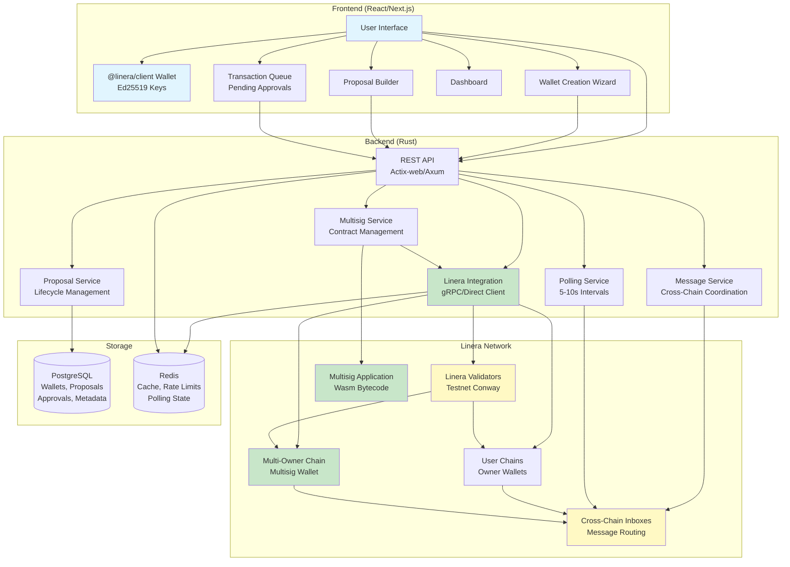
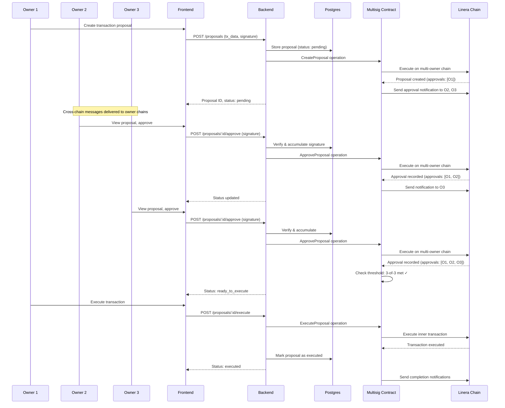
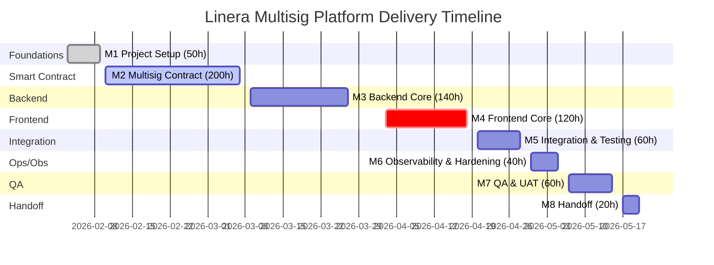

# Project Proposal — Linera Multisig Platform (Frontend + Backend)

**Document Scope**: Objectives, architecture, milestones, deliverables, risks, and dependencies

**Status**: Self-contained proposal reflecting latest learnings:

- Testnet Conway validation
- Rust backend requirement
- @linera/client frontend-only SDK
- Multi-owner chains
- Application-level threshold multisig

**Note**: No code delivery in this document.

## 1) Objectives

- Deliver a production-ready multisig platform on Linera with an excellent UX and browser-based wallet.
- Use Linera's multi-owner chain infrastructure with application-level threshold logic via custom Wasm multisig contract.
- Provide simple proposal/review/execute workflow for non-technical users.
- Support Linera native tokens and fungible applications.
- Enable multi-multisig wallet management from single interface.
- Real-time transaction status monitoring via polling (5-10s intervals) leveraging Linera's sub-second finality.
- Self-custody with Ed25519 key management via @linera/client SDK.

## 2) In-Scope

- **Frontend (Next.js/React)**: @linera/client SDK integration (Ed25519 key generation/storage), wallet creation wizard, multi-owner chain creation, proposal builder, transaction queue (pending/approvals/executed), owner management, polling-based updates (5-10s), responsive design, error/loading states.
- **Backend (Rust)**: Actix-web/Axum REST API, direct Linera integration via gRPC or compiled Linera client library, PostgreSQL (wallets/proposals/approvals/metadata), Redis (cache/rate limits), multisig Wasm contract management, proposal lifecycle service, cross-chain message coordination, polling service.
- **Smart Contract (Rust → Wasm)**: Custom multisig application using linera-sdk, m-of-n threshold logic, proposal/approval/execute operations, owner management, timeout handling.
- **Blockchain Integration**: Multi-owner chain creation (@linera/client), Wasm multisig application deployment, operation submission via SDK/gRPC, state queries, cross-chain messaging for owner notifications.
- **Security**: Ed25519 signature verification, nonce/replay protection, application-level access control (owner verification), rate limiting, CORS protection, structured logging.
- **Observability**: Prometheus metrics, Grafana dashboards, structured logging, health checks.
- **CI/CD**: GitHub Actions (lint, unit/integration, security scans, build), test suites.

## 3) Out-of-Scope

- EVM support (experimental/planned for Q2'25, not production-ready).
- Hardware wallet integration (future phase).
- Mobile native apps (responsive web only).
- MetaMask-style wallet connector (no official Linera connector exists).
- Advanced DeFi features (liquidity, trading, derivatives).
- Custody/KYC/AML flows.
- Formal security audits (prepare for later).
- Global chain indexing (only index transactions for our multisig wallets).
- GraphQL API (tested on Testnet Conway - schema doesn't load).

## 4) Architecture

### Architecture Goals

- **Linera-Native**: Use unique microchain architecture and multi-owner chains.
- **Self-Custody**: Users maintain full control of Ed25519 private keys via @linera/client.
- **Application-Level Multisig**: Smart contract with m-of-n threshold logic (no native protocol threshold).
- **Multi-Multisig Support**: Manage multiple multisig wallets from single interface.
- **Near Real-Time**: Polling-based updates (5-10s) with sub-second finality.
- **Security First**: Ed25519 key management, signature verification, threshold enforcement.
- **Cross-Chain Coordination**: Use Linera's messaging for owner notifications.

### System Architecture



### Linera Integration Approach

**Key Architecture Decisions**:

- **Smart Contracts**: Rust (linera-sdk) compiled to Wasm for application-level multisig logic.
- **Backend**: Rust service using Actix-web or Axum with direct Linera integration (gRPC or compiled client library).
- **Frontend**: TypeScript/React with @linera/client SDK (frontend-only, NOT a backend SDK).
- **Wallet**: Custom wallet implementation using @linera/client for Ed25519 key management.

**Multi-Owner Chain vs Application Multisig**:

**CRITICAL DISTINCTION**: Linera's multi-owner chains are NOT sufficient for multisig wallets.

**Multi-Owner Chain** (Protocol-level - What Linera Provides):

| Feature | Multi-Owner Chain | What We Need |
|---------|-------------------|--------------|
| Owner Control | ✅ N owners can control chain | ✅ Same |
| Threshold | ❌ 1-of-N (any owner can propose) | ❌ Need m-of-n |
| Proposals | ❌ No proposal system | ✅ Required |
| Approvals | ❌ No approval tracking | ✅ Required |
| Execution | ❌ Anyone can execute immediately | ❌ Need threshold enforcement |
| Timelocks | ❌ Not supported | ⚠️ Optional |
| Revocation | ❌ Not supported | ✅ Required |

**What Multi-Owner Chain Lacks**:

1. **No Threshold Enforcement**: Any owner can propose and execute transactions immediately
   ```bash
   # OWNER1 can execute WITHOUT owner2/owner3 approval
   # ❌ NO 2-of-3 threshold
   # ❌ NO approval counting
   ```

2. **No Proposal Lifecycle**:
   - ❌ No proposal submission tracking
   - ❌ No approval collection
   - ❌ No proposal expiration
   - ❌ No execution state management

3. **No Security Controls**:
   - ❌ No confirmation revocation
   - ❌ No double-execution prevention
   - ❌ No proposal validation

**Application Multisig** (Custom Wasm Contract - What We Must Build):

| Feature | Implementation |
|---------|----------------|
| **Submit Proposal** | `submit_proposal()` - Creates proposal, auto-confirms from submitter |
| **Confirm Proposal** | `confirm_proposal()` - Tracks approval, checks owner, enforces idempotency |
| **Execute Proposal** | `execute_proposal()` - Verifies threshold, prevents double-execution |
| **Revoke Confirmation** | `revoke_confirmation()` - Allows revoking before execution |
| **Owner Management** | `add_owner()`, `remove_owner()`, `replace_owner()` |
| **Threshold Management** | `change_threshold()` with validation rules |
| **Proposal State** | `pending_proposals`, `executed_proposals` maps |
| **Confirmation Tracking** | `confirmations` map per proposal |

**Combined Approach**:
1. Deploy multi-owner chain (protocol-level foundation)
2. Deploy multisig Wasm application on it (application-level logic)
3. Multi-owner chain provides: owner consensus for block production
4. Multisig application provides: threshold enforcement for transactions

**Source of Truth**: On-chain Wasm application holds owners, threshold, pending proposals. Off-chain PostgreSQL is UX cache (proposals, approvals, metadata) — never stores private keys.

**Cryptographic Scheme**:

- **Signature Scheme**: Ed25519 (Linera's standard).
- **Chain Ownership**: N owners with individual Ed25519 key pairs.
- **Application-Level Authorization**: Custom threshold logic in multisig contract.

## 5) Key Flow: Propose → Approve → Execute



**Key Differences from Traditional Multisig**:

- No signature aggregation at protocol level
- Each approval is a separate on-chain operation
- Application tracks approvals in state
- Threshold verification in contract logic
- Uses Linera's cross-chain messaging for coordination

## 6) Milestones & Deliverables (hours, no costs)

- **M1 Project Setup — 50h**: Requirements definition, architecture design, development environment setup (Rust toolchain, Node.js), Linera testnet access (Testnet Conway), CI/CD pipeline, database schema design, API contract definition.
- **M2 Multisig Contract — 200h**: Contract state design (owners, threshold, pending txs), Propose operation (validation, creation), Approve operation (tracking, verification), Execute operation (threshold check, inner tx execution), Owner management (add/remove, change threshold), Edge cases (revoke, replace, timeout), Unit tests, Integration tests with Linera SDK, Contract documentation.
- **M3 Backend Core — 140h**: API framework setup (Actix-web/Axum), Linera client integration (`linera-client` crate), Multisig service (contract deployment, interaction), Proposal service (CRUD, lifecycle), Message service (cross-chain notifications), Database layer (SQLx models, migrations), Polling service (5-10s intervals), Caching & rate limiting (Redis), Authentication (Ed25519 verification), Unit tests.
- **M4 Frontend Core — 120h**: Project setup (Next.js, TypeScript), @linera/client integration (wallet, keys), Wallet creation wizard, Proposal builder (visual interface), Transaction queue (pending/approvals/executed), Polling-based updates (5-10s), Dashboard, Error handling, Unit tests.
- **M5 Integration & Testing — 60h**: End-to-end integration (Frontend → Backend → Blockchain), Cross-chain messaging testing, Multi-owner testing (simulate N owners), Edge case testing (failures, timeouts), Performance testing, Bug fixes.
- **M6 Observability & Hardening — 40h**: Metrics (Prometheus, Grafana dashboards), Logging (structured logging), Health checks, Rate limiting tuning, Security hardening (input validation, CORS, headers).
- **M7 QA & UAT — 60h**: Test scenarios (multi-owner, timeout, failures), Regression testing, User acceptance testing, Bug fixes.
- **M8 Handoff — 20h**: Documentation (API docs, deployment guides), Demos, Runbooks (operations, DR, rollback), Final handoff.

Total estimate: **690h** (costing handled separately).

### Timeline Visualization



**Timeline Notes**:

- Assumes 8-hour workdays
- Total: ~18 weeks (690h)
- Estimates based on current understanding; actual hours may vary as dependencies are confirmed

### Detailed Estimation Summary

#### M2 Multisig Contract — 200h Breakdown

**Scope**:

- Contract state design
- Operations (propose, approve, execute)
- Owner management
- Edge cases
- Testing

| Component | Hours | Details |
|-----------|-------|---------|
| **Contract State Design** | 24h | Define structures for owners, threshold, pending txs, approvals |
| **Propose Operation** | 20h | Implement transaction proposal with validation |
| **Approve Operation** | 16h | Implement approval tracking and verification |
| **Execute Operation** | 28h | Implement threshold check and inner tx execution |
| **Owner Management** | 16h | Add/remove owners, change threshold |
| **Edge Cases** | 20h | Revoke, replace, timeout, cancellation |
| **Unit Tests** | 24h | Test coverage for all operations |
| **Integration Tests** | 16h | Test with Linera SDK and testnet |
| **Documentation** | 6h | Contract API documentation |
| **Wasm Compilation** | 10h | Build and deploy Wasm bytecode |
| **Cross-Chain Messages** | 20h | Implement notification messaging |

**Key Risk Factors**:

- linera-sdk learning curve for Wasm compilation
- Application-level threshold logic complexity
- Cross-chain message delivery reliability
- On-chain state management efficiency

---

#### M3 Backend Core — 140h Breakdown

**Scope**:

- REST API
- Linera integration
- Services
- Database
- Polling
- Caching

| Component | Hours | Details |
|-----------|-------|---------|
| **API Framework Setup** | 12h | Actix-web/Axum project structure, middleware |
| **Linera Client Integration** | 20h | `linera-client` + `linera-core` crates |
| **Multisig Service** | 20h | Contract deployment, interaction with Linera |
| **Proposal Service** | 18h | CRUD operations, lifecycle management |
| **Message Service** | 12h | Cross-chain notification handling |
| **Database Layer** | 24h | SQLx models, migrations, queries |
| **Polling Service** | 12h | 5-10s interval polling for state updates |
| **Caching & Rate Limiting** | 10h | Redis integration |
| **Authentication** | 8h | Ed25519 signature verification |
| **Unit Tests** | 4h | Service-level tests |

**Backend Integration** (Rust):

```rust
// Using linera-client crate (official SDK)
use linera_client::ClientContext;
use linera_core::client::ChainClient;

// Initialize context with wallet storage
let context = ClientContext::new(storage, options).await?;

// Get chain client for specific chain
let mut chain_client = context.make_chain_client(chain_id)?;

// Query balance
let balance = chain_client.query_balance().await?;

// Query application state
let state: MultisigState = chain_client
    .query_application(application_id, query)
    .await?;

// Execute operations
let certificate = chain_client
    .execute_operations(operations, blobs)
    .await?;
```

**Key Risk Factors**:

- SDK documentation gaps
- Linera protocol understanding requirements
- Cross-chain message handling
- Polling efficiency optimization

---

#### M4 Frontend Core — 120h Breakdown

**Scope**:

- React/Next.js app
- @linera/client integration
- Wallet UI
- Proposal flow

| Component | Hours | Details |
|-----------|-------|---------|
| **Project Setup** | 8h | Next.js, TypeScript, state management |
| **@linera/client Integration** | 24h | SDK wallet integration, key management |
| **Wallet Creation Wizard** | 16h | Multi-step form, threshold selection |
| **Proposal Builder** | 16h | Visual transaction builder |
| **Transaction Queue** | 16h | Pending, ready, executed tabs |
| **Polling-Based Updates** | 16h | 5-10s interval polling implementation |
| **Dashboard** | 12h | Wallet overview, activity feed |
| **Error Handling** | 8h | User-friendly error messages |
| **Unit Tests** | 4h | Component and service tests |

**Key Risk Factors**:

- @linera/client SDK evolution (potential breaking changes)
- Ed25519 key management in browser
- Multi-owner chain creation via SDK
- Polling vs. WebSocket limitations
- Complex async state management (off-chain + on-chain)

---

## 7) Technical Implementation

### Smart Contract Interface (Rust Pseudo-code)

```rust
// Multisig application state
struct MultisigState {
    owners: Vec<Owner>,
    threshold: usize,
    pending_transactions: HashMap<TxId, PendingTx>,
    nonce: u64,
}

struct PendingTx {
    proposer: Owner,
    operations: Vec<Operation>,
    approvals: HashSet<Owner>,
    created_at: Timestamp,
    expires_at: Option<Timestamp>,
}

// Application operations
enum Operation {
    Propose {
        operations: Vec<Operation>,
        nonce: u64,
        timeout: Option<Duration>,
    },
    Approve { tx_id: TxId },
    Revoke { tx_id: TxId },
    Execute { tx_id: TxId },
    AddOwner {
        owner: Owner,
        threshold: Option<usize>,
    },
    RemoveOwner {
        owner: Owner,
        threshold: Option<usize>,
    },
    ChangeThreshold { threshold: usize },
}
```

### Backend SDK Integration

**SDK**: `linera-client` + `linera-core` crates (Official Rust SDK)

**Version**: 0.15.11 (crates.io)

**Documentation**: <https://docs.rs/linera-client/latest/linera_client/>

**Key Capabilities**:

- Wallet management via `ClientContext`
- Chain operations via `ChainClient`
- Direct blockchain queries and transactions
- Application state queries
- Multi-owner chain management

**Architecture**:

```
Backend Service (Actix-web/Axum)
         |
         v
  ClientContext (linera-client)
         |
         v
    ChainClient (linera-core)
         |
         v
   Linera Network (gRPC)
```

**Example Integration**:

```rust
use linera_client::{ClientContext, config::WalletState};
use linera_core::client::ChainClient;
use linera_base::identifiers::{ChainId, ApplicationId};

pub struct MultisigService {
    context: ClientContext<WalletState>,
}

impl MultisigService {
    pub async fn new(wallet_path: &Path) -> Result<Self, Error> {
        let storage = WalletState::read_from(wallet_path).await?;
        let context = ClientContext::new(storage, Default::default()).await?;
        Ok(Self { context })
    }

    pub async fn get_chain_balance(&self, chain_id: ChainId) -> Result<Amount, Error> {
        let mut client = self.context.make_chain_client(chain_id)?;
        let balance = client.query_balance().await?;
        Ok(balance)
    }

    pub async fn query_multisig_state(
        &self,
        chain_id: ChainId,
        app_id: ApplicationId,
    ) -> Result<MultisigState, Error> {
        let mut client = self.context.make_chain_client(chain_id)?;
        let state = client.query_application(app_id, Query::GetState).await?;
        Ok(state)
    }

    pub async fn submit_proposal_operation(
        &self,
        chain_id: ChainId,
        operation: Operation,
    ) -> Result<Certificate, Error> {
        let mut client = self.context.make_chain_client(chain_id)?;
        let cert = client.execute_operation(operation).await?;
        Ok(cert)
    }
}
```

**Available Methods** (linera-core Client):

- `query_balance()` - Query chain balance
- `query_application()` - Query application state
- `execute_operations()` - Submit multiple operations
- `execute_operation()` - Submit single operation
- `transfer()` - Transfer tokens
- `synchronize_chain_state()` - Sync with validators
- `process_inbox()` - Process pending messages

**Available Methods** (linera-client ClientContext):

- `make_chain_client()` - Create ChainClient for specific chain
- `wallet()` - Access wallet state
- `ownership()` - Get chain ownership info
- `change_ownership()` - Modify chain owners
- `publish_module()` - Deploy Wasm modules
- `query_validator()` - Query validator info

### Database Schema

```sql
-- Multisig wallets
CREATE TABLE wallets (
    id UUID PRIMARY KEY,
    chain_id VARCHAR(255) UNIQUE NOT NULL,
    application_id VARCHAR(255) NOT NULL,
    owners JSONB NOT NULL,
    threshold INTEGER NOT NULL,
    nonce BIGINT DEFAULT 0,
    created_at TIMESTAMP DEFAULT NOW(),
    updated_at TIMESTAMP DEFAULT NOW()
);

-- Pending proposals
CREATE TABLE proposals (
    id UUID PRIMARY KEY,
    wallet_id UUID REFERENCES wallets(id),
    proposal_id VARCHAR(255) NOT NULL,
    proposer VARCHAR(255) NOT NULL,
    operations JSONB NOT NULL,
    approvals JSONB DEFAULT '[]',
    threshold_met BOOLEAN DEFAULT FALSE,
    status VARCHAR(50) DEFAULT 'pending',
    created_at TIMESTAMP DEFAULT NOW(),
    expires_at TIMESTAMP,
    executed_at TIMESTAMP,
    UNIQUE(wallet_id, proposal_id)
);

-- Approvals
CREATE TABLE approvals (
    id UUID PRIMARY KEY,
    proposal_id UUID REFERENCES proposals(id),
    owner VARCHAR(255) NOT NULL,
    signature TEXT NOT NULL,
    created_at TIMESTAMP DEFAULT NOW(),
    UNIQUE(proposal_id, owner)
);

-- Audit log
CREATE TABLE audit_log (
    id UUID PRIMARY KEY,
    wallet_id UUID REFERENCES wallets(id),
    proposal_id UUID REFERENCES proposals(id),
    owner VARCHAR(255) NOT NULL,
    action VARCHAR(100) NOT NULL,
    details JSONB,
    created_at TIMESTAMP DEFAULT NOW()
);
```

### Key API Endpoints

```http
# Wallet Management
POST   /api/v1/wallets                     - Create new multisig wallet
GET    /api/v1/wallets                     - List user's wallets
GET    /api/v1/wallets/:wallet_id          - Get wallet details
PUT    /api/v1/wallets/:wallet_id/owners   - Add/remove owners
PUT    /api/v1/wallets/:wallet_id/threshold - Change threshold

# Proposal Management
POST   /api/v1/wallets/:wallet_id/proposals       - Create proposal
GET    /api/v1/wallets/:wallet_id/proposals       - List proposals
GET    /api/v1/proposals/:proposal_id             - Get proposal details
POST   /api/v1/proposals/:proposal_id/approve     - Approve proposal
POST   /api/v1/proposals/:proposal_id/revoke      - Revoke proposal
POST   /api/v1/proposals/:proposal_id/execute     - Execute proposal

# Health
GET    /health                               - Health check
GET    /metrics                              - Prometheus metrics
```

## 8) Testing Strategy

### Testing Levels

- **Backend REST surface**: Actix-web/Axum endpoints for wallets, proposals, approvals, execution; health/metrics endpoints for CI smoke.
- **Smart Contract Operations**: Unit tests for propose, approve, execute, owner management operations using linera-sdk testing framework.
- **Integration Tests**: Backend + Linera testnet (Testnet Conway), cross-chain messaging, multi-owner coordination.
- **End-to-End Tests**: Complete multisig workflows (create wallet → propose → approve → execute), multi-owner scenarios, edge cases (timeout, revoke, failure).
- **Make/CI targets**: Standard targets to run unit and integration tests (smoke, full platform flow, unit).

### Test Scenarios

**Happy Path**:

1. Create 2-of-3 multisig wallet (multi-owner chain + Wasm app)
2. Owner 1 proposes transfer
3. Owner 2 approves
4. Owner 3 approves
5. Owner 1 executes
6. Verify transaction executed

**Edge Cases**:

1. Proposal timeout (expires before threshold)
2. Revoke proposal (cancel before execution)
3. Execute without threshold (should fail)
4. Duplicate approval (should be idempotent)
5. Non-owner approval (should fail)
6. Remove owner with pending proposals

**Failure Scenarios**:

1. Network failure during approval
2. Invalid signature
3. Insufficient balance
4. Contract execution failure
5. Cross-chain message delivery failure

---

## 9) Risks & Mitigations

| Risk | Mitigation | Priority |
|------|------------|----------|
| **🔴 CRITICAL BLOCKER: Custom Wasm Multisig Contract Cannot Deploy** | **IMPOSSIBLE TO MITIGATE AT PROJECT LEVEL** - Requires Linera SDK team action. See **Critical Blocker Analysis** below for complete details. | **CRITICAL** |
| **GraphQL not functional** - Tested on Testnet Conway, schema doesn't load | Use CLI wrapper or gRPC instead; build REST API in Rust | **High** |
| **No official backend SDK** - @linera/client is frontend-only | Build Rust backend with direct Linera integration (gRPC/compiled client); budget +20% backend time | **High** |
| **No wallet connector** - No MetaMask-style connector for Linera | Build custom wallet using @linera/client SDK (Ed25519 key management); budget +40h frontend | **High** |
| **Cross-chain message delivery** - Asynchronous messaging can fail | Error handling, retry logic, monitoring, timeout handling | **Medium** |
| **SDK immaturity** - Limited documentation/examples | Budget for research, Linera community support, study examples (matching-engine) | **Medium** |
| **Testnet stability** - Testnet Conway may be unstable | Budget for debugging, contingency time, local dev network as fallback | **Medium** |
| **Fee model unknown** - Not documented; N approvals = N transactions | Measure costs during PoC; optimize operations; budget for gas costs | **Medium** |
| **Polling vs. WebSocket** - No native WebSocket support | Implement 5-10s polling; budget for optimization; monitor API costs | **Low** |

---

## 🔴 CRITICAL BLOCKER: Custom Wasm Multisig Contract Cannot Deploy

### Executive Summary

**We CANNOT build a Safe-like multisig experience on Linera at this time.**

The **Frontend and Backend are viable** using @linera/client SDK, but the **Custom Wasm Application (required for threshold multisig logic) cannot be deployed** due to an **unresolvable Linera SDK ecosystem issue**.

### What Works ✅

| Component | Technology | Status |
|-----------|-----------|--------|
| **Frontend** | React + @linera/client SDK | ✅ **VIABLE** - Official TypeScript SDK available |
| **Backend** | Node.js/TypeScript + @linera/client | ✅ **VIABLE** - Same SDK works for backend API |
| **Wallet Integration** | @linera/client built-in wallet | ✅ **VIABLE** - Ed25519 key management included |
| **Multi-Owner Chains** | Native Linera protocol | ✅ **WORKING** - Verified on Testnet Conway |

### What DOES NOT Work ❌

| Component | Technology | Status |
|-----------|-----------|--------|
| **Custom Wasm Multisig** | Rust + linera-sdk → Wasm | ❌ **BLOCKED** - Opcode 252 deployment failure |
| **Threshold m-of-n Logic** | Application-level contract | ❌ **IMPOSSIBLE** - Requires Wasm deployment |
| **Safe-like UX** | Proposal/approve/execute workflow | ❌ **CANNOT PROVIDE** - Without threshold enforcement |

### Root Cause: Impossible Dependency Triangle

```
┌─────────────────────────────────────────────────────────────────┐
│           LINERA SDK ECOSYSTEM IMPOSSIBLE TRIANGLE              │
├─────────────────────────────────────────────────────────────────┤
│                                                                 │
│  linera-sdk 0.15.11                                             │
│      ↓ (requires exact version)                                 │
│  async-graphql = "=7.0.17"                                     │
│      ↓ (requires Rust 1.87+ for let-chains)                    │
│  Rust 1.87+ compiler                                            │
│      ↓ (generates bulk memory operations)                       │
│  memory.copy (Wasm opcode 252)                                  │
│      ↓ (NOT supported by Linera runtime)                        │
│  linera-kywasmtime runtime                                      │
│      ↓ ❌ DEPLOYMENT BLOCKED                                    │
│                                                                 │
└─────────────────────────────────────────────────────────────────┘
```

### Why This Cannot Be Fixed at Project Level

**All attempted workarounds FAILED**:

| Attempt | Method | Result | Why It Failed |
|---------|--------|--------|---------------|
| **Remove .clone() operations** | Code changes | ❌ | Breaks mutability (contract becomes read-only) |
| **Remove proposal history** | Simplify state | ❌ | Only 12% reduction, still 85 opcodes |
| **Remove GraphQL service** | Delete dependency | ❌ | Still generates 82 memory.copy opcodes |
| **Use Rust 1.86.0** | Downgrade compiler | ❌ | async-graphql 7.0.17 doesn't compile (let-chains) |
| **Patch async-graphql to 6.x** | [patch.crates-io] | ❌ | Exact version pin (=7.0.17) cannot be overridden |
| **Replace async-graphql** | [replace] directive | ❌ | 6.x and 7.x have incompatible crate structures |
| **Hand-written Wasm assembly** | Unsafe code | ❌ | Security risk, still may generate opcode 252 |
| **Combined ALL above** | All workarounds | ❌ | Still 67 memory.copy opcodes remain |

**Complete analysis**: [`docs/research/LINERA_OPCODE_252_ISSUE.md`](../research/LINERA_OPCODE_252_ISSUE.md)

**Failed patch attempts**: [`docs/research/ASYNC_GRAPHQL_DOWNGRADE_ATTEMPTS.md`](../research/ASYNC_GRAPHQL_DOWNGRADE_ATTEMPTS.md)

### What This Means for the Project

**WE CANNOT PROVIDE A SAFE-LIKE MULTISIG EXPERIENCE** because:

1. **No Threshold Enforcement**: Multi-owner chains are 1-of-N (any owner can execute)
2. **No Proposal Workflow**: No submit/approve/execute lifecycle
3. **No Confirmation Tracking**: Cannot track approvals across owners
4. **No Execution Controls**: Anyone with access can execute immediately

**Multi-owner chains provide**:
- ✅ Multiple owners can control a chain
- ❌ But ANY owner can propose and execute WITHOUT approval from others

**Custom Wasm contract would provide** (but CANNOT be deployed):
- ✅ m-of-n threshold enforcement
- ✅ Proposal/approve/execute workflow
- ✅ Confirmation tracking and revocation
- ✅ Execution time-delay controls
- ✅ Safe-like user experience

### Only Viable Alternatives

#### Option A: Use Multi-Owner Chains Only (Limited Experience)

**What works**:
- ✅ Multiple owners control shared wallet
- ✅ On-chain verification
- ✅ Tested and verified on Testnet Conway

**Limitations** (compared to Safe):
- ❌ No threshold - it's 1-of-N (any owner can execute)
- ❌ No proposal/approval workflow
- ❌ No confirmation tracking
- ❌ Anyone with access can execute immediately

**This is NOT a Safe-like multisig** - it's just a shared wallet.

#### Option B: Wait for Linera SDK Team Resolution

**Required actions** (Linera team ONLY):
1. Update `linera-kywasmtime` to support Wasm Bulk Memory Operations, OR
2. Refactor `linera-sdk` to use async-graphql 6.x (Rust 1.86 compatible), OR
3. Provide alternative query layer compatible with Rust 1.86

**Track progress**: [Issue #4742](https://github.com/linera-io/linera-protocol/issues/4742)

**Timeline**: UNKNOWN - Not under project control

#### Option C: Build Off-Chain Multisig (Less Secure)

**Approach**: Use backend service for multisig logic instead of smart contract

**Problems**:
- ❌ Less secure (trust backend, not trustless)
- ❌ Centralized point of failure
- ❌ Not truly decentralized
- ❌ Defeats purpose of blockchain multisig

### Impact on Proposal

**Original proposal assumes**: Custom Wasm multisig contract can be deployed

**Current reality**: Contract cannot be deployed due to SDK ecosystem blocker

**What we CAN deliver**:
- ✅ Frontend (React + @linera/client)
- ✅ Backend REST API (Node.js/TypeScript)
- ✅ Wallet integration (@linera/client)
- ✅ Multi-owner chain creation
- ✅ On-chain balance queries
- ✅ Basic shared wallet functionality

**What we CANNOT deliver**:
- ❌ Safe-like multisig experience (threshold m-of-n)
- ❌ Proposal/approval/execute workflow
- ❌ Confirmation tracking
- ❌ Custom Wasm multisig contract deployment

### Recommendation

**DO NOT PROCEED** with full Safe-like multisig platform until Linera SDK team resolves the opcode 252 issue.

**Alternative approach**: Build simplified wallet using multi-owner chains only, accepting the limitations (1-of-N, no thresholds).

### Documentation

All research and test evidence documented in:
- [`docs/research/LINERA_OPCODE_252_ISSUE.md`](../research/LINERA_OPCODE_252_ISSUE.md) - Technical analysis
- [`docs/research/OPCODE_252_CODE_ANALYSIS.md`](../research/OPCODE_252_CODE_ANALYSIS.md) - Code-level analysis
- [`docs/research/OPCODE_252_INVESTIGATION_LOG.md`](../research/OPCODE_252_INVESTIGATION_LOG.md) - Complete test log (27 commands)
- [`docs/research/ASYNC_GRAPHQL_DOWNGRADE_ATTEMPTS.md`](../research/ASYNC_GRAPHQL_DOWNGRADE_ATTEMPTS.md) - Failed patch attempts
- [`docs/research/MULTISIG_GRAPHQL_SERVICE.md`](../research/MULTISIG_GRAPHQL_SERVICE.md) - GraphQL analysis

**Contract implementation status**:
- ✅ Code complete (Safe standard implementation)
- ✅ 74/74 unit tests passing
- ✅ 0 warnings after validation fixes
- ❌ Deployment BLOCKED by opcode 252

---

---

## 10) Dependencies

### External Dependencies

**Blockchain**:

- Linera Testnet Conway access and stability (validator-1.testnet-conway.linera.net:443)
- Linera Rust SDK (linera-sdk for Wasm compilation)
- Faucet availability (<https://faucet.testnet-conway.linera.net>)

**Infrastructure**:

- PostgreSQL database
- Redis cache
- Hosting provider (Vercel/AWS/etc.)

### Team Requirements

**Required**:

- Senior Rust developer (smart contract Wasm compilation with linera-sdk)
- Backend Rust developer (Actix-web/Axum, gRPC, Linera protocol)
- Frontend developer (React/Next.js, @linera/client SDK)
- DevOps engineer

**Preferred**:

- Security auditor
- Linera ecosystem expert

---

## 11) Next Steps

**Immediate Actions** (Week 1):

1. **Confirm scope and milestone plan** (hours, not costs)
2. **Verify Linera Testnet Conway access** - Ensure testnet is stable and accessible
3. **Research linera-sdk documentation** - Review Wasm compilation patterns
4. **Explore @linera/client SDK** - Review wallet management capabilities
5. **Proof of Concept** - Build minimal multisig contract on testnet
6. **Refine Hour Estimates** - After PoC, adjust estimates based on findings
7. **Assemble Team** - Hire/assign developers for each role
8. **Security Planning** - Identify auditors, plan for review

**Decision Points**:

- After PoC (Week 2): Confirm feasibility or pivot approach
- After M2 (Week 5): Review contract and approve for backend integration
- After M4 (Week 10): UX review and refinement

---

## 12) Conclusion

### 🔴 CRITICAL BLOCKER - PROJECT NOT VIABLE AS PROPOSED

**Current Status**: **BLOCKED** - Cannot deliver Safe-like multisig platform due to Linera SDK ecosystem issue.

**What Works** ✅:
- Frontend (React + @linera/client) - **VIABLE**
- Backend API (Node.js/TypeScript + @linera/client) - **VIABLE**
- Wallet Integration (@linera/client Ed25519 keys) - **VIABLE**
- Multi-Owner Chains (native Linera protocol) - **VERIFIED WORKING**

**What DOES NOT Work** ❌:
- **Custom Wasm Multisig Contract** - **CANNOT DEPLOY** (opcode 252 issue)
- **Threshold m-of-n Logic** - **IMPOSSIBLE** without Wasm contract
- **Safe-like User Experience** - **CANNOT PROVIDE** (no proposal/approve/execute workflow)

### Why The Original Proposal Is Not Viable

The proposal assumes a **custom Wasm multisig contract can be deployed** to provide:
- m-of-n threshold enforcement
- Proposal/approval/execute workflow
- Safe-like user experience

**Reality**: This contract **CANNOT be deployed** due to an **unresolvable Linera SDK ecosystem issue**.

### The Impossible Triangle

```
linera-sdk 0.15.11
    └─ async-graphql = "=7.0.17" (exact version pin)
        └─ requires Rust 1.87+ (for let-chains)
            └─ generates memory.copy (opcode 252)
                └─ Linera runtime doesn't support ❌
```

**All attempted workarounds FAILED** (see Section 9 for complete analysis).

### What We CAN Deliver

If we proceed WITHOUT custom Wasm multisig contract:

**Available Features** (using multi-owner chains only):
- ✅ Shared wallet with multiple owners
- ✅ On-chain balance tracking
- ✅ Basic transaction operations
- ✅ Frontend wallet interface
- ✅ Backend REST API

**Missing Features** (compared to Safe):
- ❌ No threshold m-of-n (it's 1-of-N - any owner can execute)
- ❌ No proposal/approval workflow
- ❌ No confirmation tracking
- ❌ No execution time-delay controls
- ❌ No Safe-like security model

**This is NOT a multisig platform** - it's just a shared wallet.

### Recommendation

**DO NOT PROCEED** with full Safe-like multisig platform as proposed.

**Options**:

1. **WAIT** for Linera SDK team to resolve opcode 252 issue
   - Track: [Issue #4742](https://github.com/linera-io/linera-protocol/issues/4742)
   - Timeline: UNKNOWN

2. **BUILD SIMPLIFIED VERSION** using multi-owner chains only
   - Accept 1-of-N limitation (any owner can execute)
   - No Safe-like features
   - Not competitive with existing multisig solutions

3. **CHOOSE DIFFERENT BLOCKCHAIN** with working multisig support
   - Hathor (has working multisig)
   - Ethereum (Gnosis Safe)
   - Other established chains

### Impact Assessment

**Original Estimate**: 580-690 hours (~15-18 weeks)

**Reality**:
- ✅ Frontend/Backend with @linera/client: **VIABLE** (~300 hours)
- ❌ Custom Wasm multisig: **IMPOSSIBLE** (blocked by SDK issue)
- ❌ Safe-like UX: **CANNOT PROVIDE** (requires threshold logic)

**Revised Estimate for Simplified Version** (multi-owner chains only):
- ~300 hours (~8 weeks) for basic shared wallet
- NOT competitive with dedicated multisig platforms
- DOES NOT meet original Safe-like requirements

---

### ❌ Threshold Signatures Alternative Experiment (February 4, 2026)

**Status**: FAILED - Same SDK ecosystem blocker

**Experiment Location**: Branch `feature/threshold-signatures-alternative`

**What Was Tested**: An alternative architecture attempting to avoid the opcode 252 blocker by:
- Using **threshold signatures** instead of proposal state machine
- Moving complexity **off-chain** (signature aggregation in frontend)
- Simplifying Wasm contract to **bare minimum** (only verification)
- Removing **all non-essential dependencies** (ed25519-dalek, GraphQL operations)

**Contract Implemented**:
```rust
// Minimal Wasm contract - ~292 KB
pub struct MultisigState {
    pub owners: RegisterView<Vec<AccountOwner>>,
    pub threshold: RegisterView<u64>,
    pub aggregate_public_key: RegisterView<Vec<u8>>,
    pub nonce: RegisterView<u64>,
}
// NO proposal history, NO GraphQL operations, NO signature verification
```

**Result**: ❌ **STILL BLOCKED by opcode 252**

```
Opcode 252 (memory.copy): 73 instancias detectadas
Deploy to Linera testnet: FALLARÍA
```

**Key Discovery**: The opcode 252 problem is **NOT in contract code** but in **linera-sdk itself**:

```
linera-sdk 0.15.11
    └─ async-graphql = "=7.0.17" (OBLIGATORY)
        └─ genera memory.copy (opcode 252)
```

Even when using `async-graphql` **only for ABI** (no operations), the compiled bytecode **STILL CONTAINS** opcode 252.

**Why This Matters**:

This experiment **proves conclusively** that:
1. **Code-level workarounds are impossible** - any contract using linera-sdk will have opcode 252
2. **Architecture changes don't help** - the problem is in SDK dependencies, not contract design
3. **Threshold signatures is NOT a solution** - same blocker as original proposal

**Complete Documentation**:
- Experiment README: [`experiments/threshold-signatures/README.md`](../../experiments/threshold-signatures/README.md)
- Architecture details: [`experiments/threshold-signatures/docs/ARCHITECTURE.md`](../../experiments/threshold-signatures/docs/ARCHITECTURE.md)

**Implication**: This confirms that **only Linera team action** can resolve the blocker. No project-level workaround exists.

---

### Final Verdict

**The Linera multisig platform proposal as specified is NOT VIABLE** due to:
1. Custom Wasm multisig contract cannot be deployed (SDK ecosystem blocker)
2. Multi-owner chains lack threshold m-of-n logic
3. Cannot provide Safe-like user experience without custom contract

**Recommendation**: **HOLD** project until Linera SDK team resolves the opcode 252 issue.

See **Section 9: Critical Blocker Analysis** for complete technical details and all failed workaround attempts.

---

**Produced by Palmera DAO Team**
**Last Updated**: February 4, 2026
**Status**: 🔴 BLOCKED - Awaiting Linera SDK ecosystem resolution
