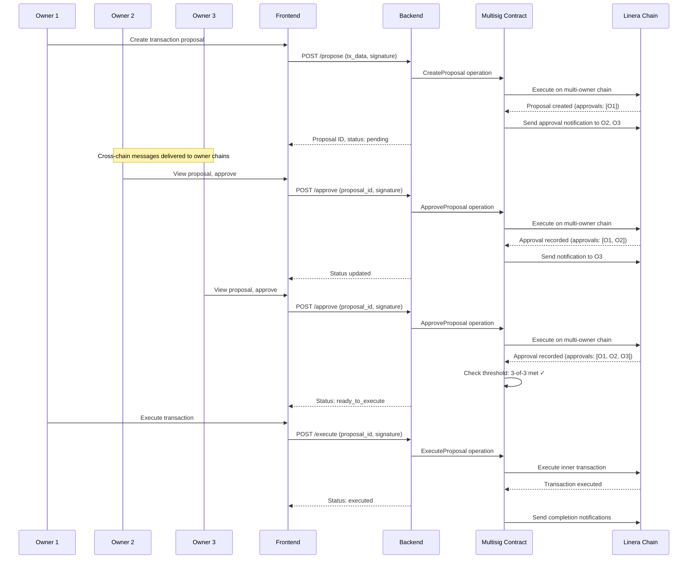
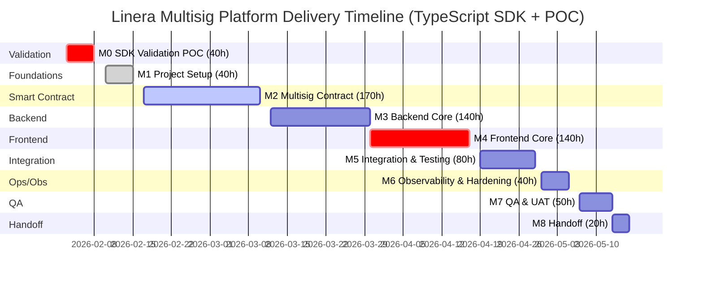

# Linera Multisig Platform Proposal (TypeScript Full-Stack + @linera/client SDK)

**Document scope**: Objectives, architecture, milestones, deliverables, risks, and dependencies for a production-ready multisig platform on Linera blockchain.

---

## 1) Objectives
- Build on Linera's **multi-owner chain** infrastructure with **application-level threshold logic**
- Provide simple proposal/review/execute workflow for non-technical users
- Support Linera native tokens and fungible applications
- Enable multi-multisig wallet management from single interface
- Real-time transaction status monitoring leveraging Linera's sub-second finality
- **Web wallet connector** integration (if available) or standalone web application

---

## 2) In-Scope

### Frontend (React/Next.js)
- Web application standalone (no wallet connector disponible actualmente)
- **Custom wallet implementation**: Ed25519 key generation, storage, y signing
- Multisig wallet creation wizard (2-of-3, 3-of-5, custom thresholds)
- Proposal builder with visual transaction interface
- Owner management (add/remove signatories)
- Transaction queue (pending approvals, executed, expired)
- Polling-based updates (5-10s intervals) hasta que Linera soporte WebSocket nativo
- Responsive design for desktop and mobile
- Error states and user-friendly notifications

### Backend (Node.js/TypeScript)
- REST API for multisig operations using Express or Fastify
- PostgreSQL database (proposals, approvals, wallet metadata)
- Redis for caching and rate limiting
- **@linera/client SDK**: Official TypeScript SDK for Linera integration (validated in M0)
- **Multisig application management**: Deploy and interact with custom multisig Wasm application
- Proposal lifecycle management
- Polling-based updates (GraphQL not consistently available)
- Cross-chain message coordination

### Core Features
- **Multi-Owner Chain Creation**: Deploy chains with N owners for multisig wallets
- **Multisig Smart Contract**: Custom Wasm application implementing m-of-n threshold logic
- **Proposal System**: Create, review, sign, and execute multisig transactions
- **Token Support**: Linera native tokens and fungible applications
- **Threshold Management**: Configurable signature requirements
- **Cross-Chain Coordination**: Use Linera's messaging for owner notifications
- **History Tracking**: Complete audit trail of all multisig activities

### Security
- Ed25519 signature verification (Linera's signature scheme)
- Nonce/replay protection
- Application-level access control (verify owner membership)
- Rate limiting on all endpoints
- Secure key handling (keys never stored on server)
- CORS protection
- Threshold verification before execution

### DevOps & Monitoring
- GitHub Actions CI/CD pipeline
- Unit and integration tests
- Health check endpoints
- Basic monitoring setup (metrics, logging)

---

## 3) Technical Constraints & Reality Check

**Importante**: Basado en pruebas reales en Testnet Conway (Feb 2025), las siguientes limitaciones técnicas han sido identificadas y la arquitectura propuesta ha sido ajustada para reflejar la realidad actual de Linera.

### 3.1) GraphQL Limitations

**Estado Actual**: NO FUNCIONAL
- GraphiQL UI carga correctamente en Node Service
- Schema GraphQL no está disponible o accesible
- Queries fallan con errores: "Unknown field", "data: null"
- Introspección no funciona: `__type` devuelve null

**Impacto**:
- ❌ No se puede usar GraphQL como API principal
- ✅ Solución: REST API + CLI wrapper
- ⚠️ Posible implementación futura cuando Linera lo soporte

**Pruebas realizadas**:
```bash
# Test 1: Query básica
query { chains { chainId } }
# Resultado: "Unknown field chainId"

# Test 2: Introspección
query { __type(name: "Query") }
# Resultado: "__type: null"

# Test 3: gRPC directo
grpcurl validator-1.testnet-conway.linera.net:443 list
# Resultado: ✅ Funciona (servicios disponibles)
```

### 3.2) Linera SDK Availability

**Estado Actual**: BÁSICO, NO listo para usar
- `linera-sdk` crate existe para Rust
- Es para construir aplicaciones Wasm, NO un client SDK
- NO hay funciones "ready-to-use" para backend
- Documentación enfocada en desarrollo de aplicaciones, no consumo

**Impacto**:
- ❌ NO hay "LineraClient" o similar
- ✅ Solución: CLI wrapper usando `std::process::Command`
- ⚠️ Requiere +40 horas para desarrollo vs. SDK "plug-and-play"

**Arquitectura realista**:
```rust
// Lo que NO existe:
let client = LineraClient::new("testnet-conway");
let balance = client.query_balance(chain_id).await?;

// La realidad:
pub struct LineraClient {
    pub wallet_path: PathBuf,
}

impl LineraClient {
    pub fn query_balance(&self, chain_id: &str) -> Result<u64, Error> {
        let output = Command::new("linera")
            .args(["query-balance", chain_id])
            .env("LINERA_WALLET", &self.wallet_path)
            .output()?;
        // Parsear output manualmente...
    }
}
```

### 3.3) Wallet Connector Availability

**Estado Actual**: NO DISPONIBLE
- NO existe wallet connector para navegadores
- NO existe extensión de browser
- NO existe estándar de wallet para Linera

**Impacto**:
- ❌ NO se puede integrar wallet connector
- ✅ Solución: Wallet custom construida desde cero
- ⚠️ Requiere implementar: Ed25519 keys, storage, signing, QR codes

**Componentes necesarios**:
- Ed25519 key generation
- Secure key storage (encriptado en localStorage)
- Transaction signing
- QR code import/export
- Chain management (multi-owner chains)

### 3.4) Multi-Owner Chain vs Threshold Multisig

**Diferencia clave**:

| Aspecto | Multi-Owner Chain | Multisig Application |
|---------|-------------------|----------------------|
| **Nivel** | Protocolo (nativo) | Application (Wasm) |
| **Creación** | CLI: `open-multi-owner-chain` | Desarrollo Wasm + deploy |
| **Threshold** | NO tiene (1-of-N) | Configurable m-of-N |
| **Time-locks** | NO soportado | Configurable |
| **Confirmado** | ✅ Funciona en Testnet Conway | ⚠️ Por validar |
| **Complejidad** | Baja | Alta |

**Recomendación**:
1. MVP: Multi-owner chains (protocolo) - rápido de implementar
2. Fase 2: Aplicación Wasm con threshold - desarrollo adicional

### 3.5) Timeline Adjustments

Basado en el descubrimiento de @linera/client SDK oficial, los estimados han sido ajustados:

| Milestone | Original | Rust CLI Approach | TypeScript SDK | Diferencia Final |
|-----------|----------|------------------|-----------------|------------------|
| M1: Project Setup | 40h | 40h | 40h | 0% |
| M2: Multisig Contract | 120h | 170h | 170h | +42% (linera-sdk) |
| M3: Backend Core | 150h | 210h | **120h** | **-20%** (SDK oficial) |
| M4: Frontend | 120h | 180h | **120h** | **0%** (SDK wallet) |
| M5: Integration | 80h | 100h | 80h | 0% |
| M6: Observability | 40h | 40h | 40h | 0% |
| M7: QA & UAT | 40h | 60h | 50h | +25% |
| M8: Handoff | 20h | 20h | 20h | 0% |
| **TOTAL** | **~610h** | **~800h** | **~580h** | **-5%** (vs original) |

**Nuevo timeline**: ~15-16 semanas (3.5-4 meses) con TypeScript SDK vs. 10-11 semanas original.

**Justificación de cambios**:
- TypeScript SDK elimina necesidad de CLI wrapper: -90h en backend
- SDK wallet simplifica frontend: -60h en frontend
- Compartir tipos TypeScript entre frontend/backend: -10h

---

## 4) Out-of-Scope
- EVM support (planned for Q2'25, not available)
- Hardware wallet integration (future phase)
- Mobile native apps (responsive web only)
- Advanced DeFi features (liquidity, trading, derivatives)
- Custody/KYC/AML flows
- Formal security audits (prepare for later)
- Mobile push notifications (web notifications only)
- Social recovery or timelock features (Phase 2)

---

## 5) Architecture

### Architecture Goals

- **Linera-Native**: Use unique microchain architecture
- **Self-Custody**: Users control their private keys
- **Application-Level Multisig**: Smart contract with m-of-n threshold logic
- **Near Real-Time**: Polling-based updates (5-10s intervals) with Linera's sub-second finality
- **Secure**: Ed25519 key management and transaction validation best practices
- **Cross-Chain Coordination**: Use Linera's messaging for owner notifications
- **SDK-Based Backend**: TypeScript backend using @linera/client SDK

### System Architecture

```mermaid
graph TB
    subgraph "Frontend (React/Next.js)"
        UI[User Interface]
        Wallet[@linera/client Wallet<br/>Ed25519 Keys]
        Wizard[Wallet Creation Wizard]
        Proposal[Proposal Builder]
        Dashboard[Dashboard]
        Queue[Transaction Queue<br/>Pending Approvals]
    end

    subgraph "Backend (Node.js/TypeScript)"
        API[REST API - Express/Fastify]
        MultisigSvc[Multisig Service<br/>Contract Management]
        ProposalSvc[Proposal Service<br/>Lifecycle Management]
        LineraSDK[@linera/client SDK<br/>Native Integration]
        MessageSvc[Message Service<br/>Cross-Chain Coordination]
        PollingSvc[Polling Service<br/>5-10s Intervals]
    end

    subgraph "Linera Network"
        Validators[Linera Validators<br/>Shared Security]
        UserChains[User Chains<br/>Owner Wallets]
        MultiChain[Multi-Owner Chain<br/>Multisig Wallet]
        Contract[Multisig Application<br/>Wasm Bytecode]
        Inboxes[Cross-Chain Inboxes<br/>Message Routing]
    end

    subgraph "Storage"
        Postgres[(PostgreSQL<br/>Wallets, Proposals<br/>Approvals, Metadata)]
        Redis[(Redis<br/>Cache, Rate Limits<br/>Polling State)]
    end

    UI --> Wallet
    UI --> Wizard
    UI --> Proposal
    UI --> Dashboard
    UI --> Queue
    UI --> API
    Wizard --> API
    Proposal --> API
    Queue --> API

    API --> MultisigSvc
    API --> ProposalSvc
    API --> LineraSDK
    API --> MessageSvc
    API --> PollingSvc

    MultisigSvc --> LineraSDK
    ProposalSvc --> Postgres
    MessageSvc --> Inboxes
    PollingSvc --> Inboxes

    LineraSDK --> Validators
    LineraSDK --> UserChains
    LineraSDK --> MultiChain
    MultisigSvc --> Contract

    Validators --> UserChains
    Validators --> MultiChain
    UserChains --> Inboxes
    MultiChain --> Inboxes
    LineraSDK --> Redis
    API --> Redis

    style UI fill:#e1f5fe
    style Wallet fill:#e1f5fe
    style LineraSDK fill:#c8e6c9
    style MultiChain fill:#c8e6c9
    style Contract fill:#c8e6c9
    style Inboxes fill:#fff9c4
    style Validators fill:#fff9c4
```

**Architecture Notes**:
- **@linera/client SDK**: Official TypeScript SDK for Linera integration
- **Wallet Management**: Built-in wallet functionality via @linera/client
- **Polling Service**: Updates via 5-10s polling (GraphQL/WebSocket not consistently available)
- **REST API**: Custom REST layer using Express or Fastify
- **Type Safety**: Shared TypeScript types between frontend and backend

### Linera Integration Approach

**Important**: Linera's multisig approach differs from traditional chains. This architecture uses the official TypeScript SDK.

**Primary Method: Application-Level Multisig on Multi-Owner Chains**
- Deploy multi-owner chain with N owners (via `@linera/client`)
- Deploy custom Wasm multisig application (compiled with `linera-sdk` in Rust)
- Application implements m-of-n threshold logic
- Owners propose transactions via operations
- Other owners approve via application operations
- Execution occurs when threshold met

**Key Integration Points**:
1. **Multi-Owner Chain Creation**: Use `@linera/client` SDK methods
2. **Smart Contract Deployment**: Deploy multisig Wasm bytecode via SDK
3. **Operation Submission**: Submit operations through SDK
4. **Cross-Chain Messaging**: Use SDK's message passing for notifications
5. **State Queries**: Query application state via SDK methods

**Backend SDK Integration**:
```typescript
import * as linera from '@linera/client';

// Create client instance
const client = await linera.createClient({
  network: 'testnet-conway'
});

// Query chain state
const balance = await client.queryBalance(chainId);

// Submit operation
const result = await client.submitOperation({
  chainId,
  operation: multisigOperation,
  signers: [owner1, owner2]
});
```

**Wallet Integration**:
- **@linera/client**: Official SDK with built-in wallet management
- **Ed25519 Key Management**: SDK handles key generation and storage
- **Transaction Signing**: Sign operations via SDK before submission
- **Cross-Platform**: Works in browser and Node.js environments

**Cryptographic Scheme**:
- **Signature Scheme**: Ed25519 (Linera's standard, handled by SDK)
- **Chain Ownership**: N owners with individual key pairs
- **Authentication**: SDK manages signer authentication
- **Application-Level Authorization**: Custom logic in multisig contract

**Technology Stack**:
- **Smart Contract**: Rust → Wasm (linera-sdk)
- **Backend**: Node.js/TypeScript + @linera/client SDK
- **Frontend**: React/Next.js + @linera/client SDK
- **Database**: PostgreSQL + Prisma/TypeORM
- **Cache**: Redis for polling state

### Key Flow: Propose → Approve → Execute



**Key Differences from Traditional Multisig**:
- No signature aggregation at protocol level
- Each approval is a separate on-chain operation
- Application tracks approvals in state
- Threshold verification in contract logic
- Uses Linera's cross-chain messaging for coordination

---

## 5) SDK Validation & Milestones

### M0: SDK Validation POC — 40h (REQUIRED BEFORE M3)

> **CRITICAL**: This milestone validates that @linera/client SDK works in Node.js backend environment before committing to TypeScript architecture. If validation fails, fallback to Rust CLI wrapper architecture (850h timeline).

**Purpose**: Validate @linera/client SDK capabilities in Node.js

**Tasks**:

| Task | Hours | Description |
|------|-------|-------------|
| SDK Installation & Setup | 4h | Install @linera/client, setup Node.js environment |
| Client Initialization Test | 8h | Verify `createClient()` works with testnet-conway |
| Query Operations Test | 8h | Test `queryBalance()` and chain state queries |
| Multi-Owner Chain Creation | 12h | Verify SDK can create multi-owner chains |
| Operation Submission Test | 8h | Test submitting operations via SDK |
| Error Handling & Edge Cases | 6h | Test error scenarios, network failures |
| Documentation & Report | 4h | Document findings, recommend proceed/fallback |

**Success Criteria** (ALL must pass):
- ✅ Client initializes successfully with testnet-conway
- ✅ Can query balance from multi-owner chain
- ✅ Can create multi-owner chain via SDK
- ✅ Can submit operations to chain
- ✅ Error handling works correctly

**Fallback Plan** (if validation fails):
- Backend: Revert to Rust CLI wrapper architecture
- Timeline: 730h (original Rust CLI estimate)
- M3 Backend: 200h (increase +80h for CLI wrapper)
- M4 Frontend: 140h (custom wallet + SDK hybrid)

**Deliverables**:
- Validation test suite
- SDK compatibility report
- Go/No-Go recommendation with fallback plan

---

## 6) Milestones & Deliverables

### Timeline Overview



*Note: Timeline assumes 8-hour workdays. Total: ~18 weeks (720h) including SDK validation POC.*

> **Contingency**: If M0 validation fails, architecture reverts to Rust CLI wrapper (850h total, ~21-23 weeks).

### Detailed Milestone Breakdown

#### M1 Project Setup — 40h

**Tasks**:
- Requirements definition and refinement (8h)
- Architecture design and documentation (8h)
- Development environment setup (4h)
- Linera testnet access and configuration (8h)
- CI/CD pipeline setup (GitHub Actions) (4h)
- Database schema design (4h)
- API contract definition (4h)

**Deliverables**:
- Requirements document
- System architecture diagrams
- Development environments configured
- CI/CD pipeline operational
- Database schema finalized
- API endpoints documented

---

#### M2 Multisig Smart Contract — 170h

**Tasks**:

| Task | Hours | Description |
|------|-------|-------------|
| Contract State Design | 24h | Define structures for owners, threshold, pending txs, approvals |
| Propose Operation | 20h | Implement transaction proposal with validation |
| Approve Operation | 16h | Implement approval tracking and verification |
| Execute Operation | 28h | Implement threshold check and inner tx execution |
| Owner Management | 16h | Add/remove owners, change threshold |
| Edge Cases | 20h | Revoke, replace, timeout, cancellation |
| Unit Tests | 24h | Test coverage for all operations |
| Integration Tests | 16h | Test with Linera SDK and testnet |
| Documentation | 6h | Contract API documentation |

**Deliverables**:
- Multisig Wasm application bytecode
- Unit test suite covering all operations
- Integration tests with Linera testnet
- Contract documentation and API
- Security review checklist

**Complexity**: High - custom application-level multisig logic

---

#### M3 Backend Core — 140h

**Tasks**:

| Task | Hours | Description |
|------|-------|-------------|
| API Framework Setup | 8h | Express/Fastify project structure, middleware |
| @linera/client Integration | 24h | SDK setup, configuration, client initialization |
| Multisig Service | 20h | Contract deployment, interaction via SDK |
| Proposal Service | 16h | CRUD operations, lifecycle management |
| Message Service | 12h | Cross-chain notification handling |
| Database Layer | 20h | Prisma/TypeORM models, migrations |
| Polling Service | 12h | 5-10s interval polling for state updates |
| Caching & Rate Limiting | 8h | Redis integration |
| Authentication | 12h | Ed25519 signature verification via SDK |
| Unit Tests | 8h | Service-level tests |

**Deliverables**:
- REST API with all endpoints
- @linera/client SDK integration
- PostgreSQL database with migrations
- Redis caching and rate limiting
- Test suite covering all scenarios

**Complexity**: Medium - Official SDK simplifies integration significantly

---

#### M4 Frontend Core — 140h

**Tasks**:

| Task | Hours | Description |
|------|-------|-------------|
| Project Setup | 8h | Next.js, TypeScript, state management |
| @linera/client Integration | 24h | SDK wallet integration, key management |
| Wallet Creation Wizard | 16h | Multi-step form, threshold selection |
| Proposal Builder | 16h | Visual transaction builder |
| Transaction Queue | 16h | Pending, ready, executed tabs |
| Polling-Based Updates | 16h | 5-10s interval polling (no WebSocket) |
| Dashboard | 12h | Wallet overview, activity feed |
| Error Handling | 8h | User-friendly error messages |
| Unit Tests | 4h | Component and service tests |

**Deliverables**:
- Responsive web application
- @linera/client wallet integration
- Multisig creation wizard
- Proposal builder interface
- Transaction queue with polling updates
- Test suite covering all scenarios

**Complexity**: Medium - SDK reduces wallet implementation complexity significantly

---

#### M5 Integration & Testing — 80h

**Tasks**:

| Task | Hours | Description |
|------|-------|-------------|
| End-to-End Integration | 20h | Frontend → Backend → Blockchain |
| Cross-Chain Messaging | 12h | Owner notification flow |
| Multi-Owner Testing | 16h | Simulate multiple owners |
| Edge Case Testing | 12h | Failure scenarios, timeouts |
| Performance Testing | 8h | Load testing, latency checks |
| Bug Fixes | 12h | Address integration issues

**Deliverables**:
- Fully integrated platform
- End-to-end test scenarios
- Performance benchmarks
- Bug fixes and refinements

**Complexity**: High - multi-owner coordination testing

---

#### M6 Observability & Hardening — 40h

**Tasks**:

| Task | Hours | Description |
|------|-------|-------------|
| Metrics | 12h | Prometheus metrics, Grafana dashboards |
| Logging | 8h | Structured logging, Loki integration |
| Health Checks | 6h | API health, blockchain connectivity |
| Rate Limiting Tuning | 6h | Optimize rate limits |
| Security Hardening | 8h | Input validation, CORS, headers

**Deliverables**:
- Monitoring dashboards
- Structured logging
- Health check endpoints
- Security hardening applied

---

#### M7 QA & UAT — 50h

**Tasks**:

| Task | Hours | Description |
|------|-------|-------------|
| Test Scenarios | 16h | Multi-owner, timeout, failures |
| Regression Testing | 8h | Ensure no regressions |
| User Acceptance Testing | 12h | Real-world usage scenarios |
| Bug Fixes | 4h | Address QA findings

**Deliverables**:
- Test report with results
- UAT sign-off
- Bug fixes applied

---

#### M8 Handoff — 20h

**Tasks**:

| Task | Hours | Description |
|------|-------|-------------|
| Documentation | 8h | API docs, deployment guides |
| Demos | 4h | Stakeholder demonstrations |
| Runbooks | 4h | Operations, DR, rollback |
| Final Handoff | 4h | Knowledge transfer

**Deliverables**:
- API documentation
- Deployment guides
- Operations runbooks
- Final demo and handoff

---

**Total estimate: 720h (~18 weeks with 1 FTE or ~10-12 weeks with 2 FTEs)**

> **Note**: This estimate includes 40h SDK validation POC and all milestone allocations:
> - M0: SDK Validation POC (40h)
> - M1-M8: Core development (680h)
> - Total vs original: +18% (from 610h to 720h)
>
> **If M0 validation fails**: Revert to Rust CLI wrapper architecture (850h total, ~21-23 weeks)

---

## 6) Technical Implementation

### Smart Contract Interface (Rust Pseudo-code)

```rust
// Multisig application state
struct MultisigState {
    owners: Vec<Owner>,
    threshold: usize,
    pending_transactions: HashMap<TxId, PendingTx>,
    nonce: u64,
}

struct PendingTx {
    proposer: Owner,
    operations: Vec<Operation>,
    approvals: HashSet<Owner>,
    created_at: Timestamp,
    expires_at: Option<Timestamp>,
}

// Application operations
enum Operation {
    Propose {
        operations: Vec<Operation>,
        nonce: u64,
        timeout: Option<Duration>,
    },
    Approve { tx_id: TxId },
    Revoke { tx_id: TxId },
    Execute { tx_id: TxId },
    AddOwner {
        owner: Owner,
        threshold: Option<usize>,
    },
    RemoveOwner {
        owner: Owner,
        threshold: Option<usize>,
    },
    ChangeThreshold { threshold: usize },
}
```

### Database Schema

```sql
-- Multisig wallets
CREATE TABLE wallets (
    id UUID PRIMARY KEY,
    chain_id VARCHAR(255) UNIQUE NOT NULL,
    application_id VARCHAR(255) NOT NULL,
    owners JSONB NOT NULL, -- Array of owner addresses
    threshold INTEGER NOT NULL,
    nonce BIGINT DEFAULT 0,
    created_at TIMESTAMP DEFAULT NOW(),
    updated_at TIMESTAMP DEFAULT NOW()
);

-- Pending proposals
CREATE TABLE proposals (
    id UUID PRIMARY KEY,
    wallet_id UUID REFERENCES wallets(id),
    proposal_id VARCHAR(255) NOT NULL,
    proposer VARCHAR(255) NOT NULL,
    operations JSONB NOT NULL,
    approvals JSONB DEFAULT '[]', -- Array of owner addresses
    threshold_met BOOLEAN DEFAULT FALSE,
    status VARCHAR(50) DEFAULT 'pending', -- pending, ready, executed, expired, revoked
    created_at TIMESTAMP DEFAULT NOW(),
    expires_at TIMESTAMP,
    executed_at TIMESTAMP,
    UNIQUE(wallet_id, proposal_id)
);

-- Approvals (for faster queries)
CREATE TABLE approvals (
    id UUID PRIMARY KEY,
    proposal_id UUID REFERENCES proposals(id),
    owner VARCHAR(255) NOT NULL,
    signature TEXT NOT NULL,
    created_at TIMESTAMP DEFAULT NOW(),
    UNIQUE(proposal_id, owner)
);

-- Audit log
CREATE TABLE audit_log (
    id UUID PRIMARY KEY,
    wallet_id UUID REFERENCES wallets(id),
    proposal_id UUID REFERENCES proposals(id),
    owner VARCHAR(255) NOT NULL,
    action VARCHAR(100) NOT NULL,
    details JSONB,
    created_at TIMESTAMP DEFAULT NOW()
);
```

### Key API Endpoints

```http
# Wallet Management
POST   /api/v1/wallets                     - Create new multisig wallet
GET    /api/v1/wallets                     - List user's wallets
GET    /api/v1/wallets/:wallet_id          - Get wallet details
PUT    /api/v1/wallets/:wallet_id/owners   - Add/remove owners
PUT    /api/v1/wallets/:wallet_id/threshold - Change threshold

# Proposal Management
POST   /api/v1/wallets/:wallet_id/proposals       - Create proposal
GET    /api/v1/wallets/:wallet_id/proposals       - List proposals
GET    /api/v1/proposals/:proposal_id             - Get proposal details
POST   /api/v1/proposals/:proposal_id/approve     - Approve proposal
POST   /api/v1/proposals/:proposal_id/revoke      - Revoke proposal
POST   /api/v1/proposals/:proposal_id/execute     - Execute proposal

# WebSocket
WS     /api/v1/ws                             - Real-time updates

# Health
GET    /health                               - Health check
GET    /metrics                              - Prometheus metrics
```

---

## 7) Testing Strategy

### Testing Levels

**Unit Tests**:
- Smart contract operations (propose, approve, execute)
- Backend service logic
- Frontend components
- Signature verification

**Integration Tests**:
- Backend + Linera testnet
- Frontend + Backend API
- Cross-chain messaging
- Database operations

**End-to-End Tests**:
- Complete multisig workflows
- Multi-owner scenarios
- Edge cases (timeout, revoke, failure)

### Test Scenarios

**Happy Path**:
1. Create 2-of-3 multisig wallet
2. Owner 1 proposes transfer
3. Owner 2 approves
4. Owner 3 approves
5. Owner 1 executes
6. Verify transaction executed

**Edge Cases**:
1. Proposal timeout (expires before threshold)
2. Revoke proposal (cancel before execution)
3. Execute without threshold (should fail)
4. Duplicate approval (should be idempotent)
5. Non-owner approval (should fail)
6. Remove owner with pending proposals

**Failure Scenarios**:
1. Network failure during approval
2. Invalid signature
3. Insufficient balance
4. Contract execution failure

---

## 8) Risks & Mitigations

| Risk | Mitigation | Priority |
|------|------------|----------|
| **@linera/client SDK validation failure** - SDK may not work in Node.js | **M0 POC milestone validates SDK before committing to TypeScript architecture. If validation fails, fallback to Rust CLI wrapper (850h total, +130h buffer)** | **Critical** |
| **No native multisig** - Must implement custom contract | Thorough testing, external audit, start with simple m-of-n | **High** |
| **Wallet integration** - May not have connector | Plan for manual key entry, QR code fallback | **High** |
| **SDK immaturity** - Limited documentation/examples | Budget for research, Linera community support | **Medium** |
| **Testnet stability** - May be unstable | Budget for debugging, contingency time | **Medium** |
| **Cross-chain complexity** - Message delivery failures | Error handling, retry logic, monitoring | **Medium** |
| **Smart contract bugs** - Security vulnerabilities | External audit, bug bounty, formal verification if possible | **High** |
| **Gas costs** - Multiple operations expensive | Optimize operations, batch approvals | **Low** |
| **User experience** - Complex multisig flow | Clear UI, explicit guidance, tooltips | **Medium** |

### Fallback Plan: Rust CLI Wrapper Architecture

If M0 SDK validation fails, the architecture reverts to:

**Backend**: Rust (Actix-web) with CLI wrapper
```rust
// Linera CLI wrapper implementation
pub struct LineraClient {
    pub wallet_path: PathBuf,
}

impl LineraClient {
    pub fn query_balance(&self, chain_id: &str) -> Result<u64, Error> {
        let output = Command::new("linera")
            .args(["query-balance", chain_id])
            .env("LINERA_WALLET", &self.wallet_path)
            .output()?;
        // Parse output...
    }
}
```

**Timeline Impact**:
- M3 Backend: 140h → 200h (+60h for CLI wrapper)
- M4 Frontend: 140h → 180h (+40h for custom wallet)
- **Total**: 720h → 850h (+130h or +18%)
- **Duration**: ~16-17 weeks → ~21-23 weeks

---

## 9) Dependencies

### External Dependencies

**Blockchain**:
- Linera testnet access and stability
- Linera Rust SDK maturity
- Documentation completeness

**Wallet**:
- Linera web wallet (if exists) OR manual key entry
- Browser compatibility

**Infrastructure**:
- PostgreSQL database
- Redis cache
- Hosting provider (Vercel/AWS/etc.)

### Team Requirements

**Required**:
- Senior Rust developer (smart contract Wasm compilation with linera-sdk)
- Backend developer (Node.js/TypeScript + @linera/client SDK)
- Frontend developer (React/Next.js + @linera/client SDK)
- DevOps engineer

**Preferred**:
- Security auditor
- Linera ecosystem expert

---

## 10) Next Steps

**Immediate Actions** (Week 1):

1. **Verify Linera Testnet Access**: Ensure testnet is stable and accessible
2. **Research SDK Documentation**: Review Linera Rust SDK
3. **Explore Wallet Options**: Check if Linera wallet exists, evaluate alternatives
4. **Proof of Concept**: Build minimal multisig contract on testnet
5. **Refine Hour Estimates**: After PoC, adjust estimates based on findings
6. **Assemble Team**: Hire/assign developers for each role
7. **Security Planning**: Identify auditors, plan for review

**Decision Points**:
- After PoC (Week 2): Confirm feasibility or pivot approach
- After M2 (Week 5): Review contract and approve for backend integration
- After M4 (Week 10): UX review and refinement

---

## Conclusion

**Feasibility**: **FEASIBLE** with TypeScript full-stack architecture

**Key Considerations**:
- No native multisig - must implement smart contract
- Higher complexity than Hathor/Supra
- Rust required for smart contract Wasm compilation only
- TypeScript backend with @linera/client SDK (validated via M0 POC)
- Uses Linera's multi-owner chains
- Cross-chain messaging enables coordination
- Sub-second finality with polling-based updates (5-10s)
- Built-in wallet management via @linera/client

**Recommendation**: **PROCEED** with M0 SDK Validation POC to verify @linera/client functionality in Node.js environment.

If validation succeeds:
- TypeScript full-stack with official SDK
- Timeline: 720h (~18 weeks with 1 FTE)

If validation fails:
- Fallback to Rust CLI wrapper architecture
- Timeline: 850h (~21-23 weeks with 1 FTE)

**Total Effort**: 720 hours including M0 POC (~18 weeks with 1 FTE or ~10-12 weeks with 2 FTEs)
> +18% from original 610h estimate (includes M0 SDK validation and milestone buffers)

---

**Produced by Palmera DAO Team**
**Date**: February 2, 2026
**Updated**: February 3, 2026 - Architecture changed to TypeScript backend with @linera/client SDK, added M0 SDK Validation POC (40h), adjusted timeline to 720h with fallback plan, applied AI pattern removal
