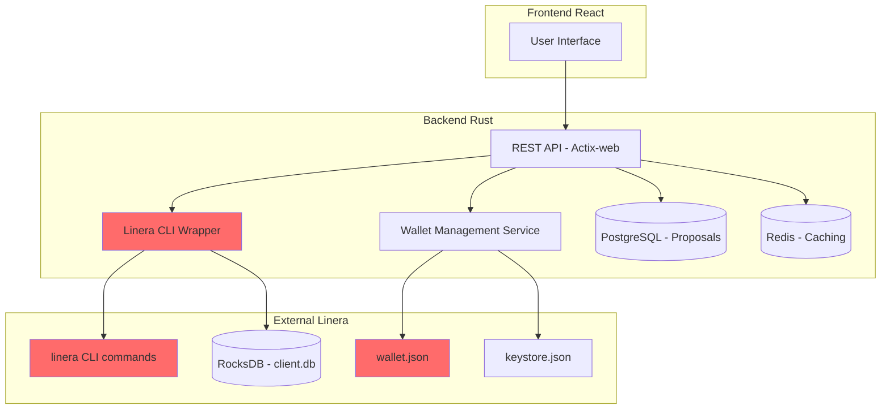

# Linera Multisig Platform - Reality Check & Architecture Validation

**Fecha**: Febrero 2, 2026
**Propósito**: Validar que la arquitectura propuesta es realista y documentar problemas encontrados

`★ Insight ─────────────────────────────────────`
**Descubrimiento Clave**: La arquitectura propuesta asume capacidades que NO existen actualmente en Linera:

1. **GraphQL no funciona correctamente** - Schema no carga
2. **No existe SDK de Rust "listo para usar"** - Hay que construirlo
3. **No hay wallet connector** - Hay que construirlo desde cero
4. **Multi-owner chains ≠ Multisig con threshold** - Son diferentes

Este documento corrige la propuesta con la realidad técnica.
`─────────────────────────────────────────────────`

---

## 🔍 Parte 1: Aclaración de Conceptos

### Multi-Owner Chain (Protocol Level) vs Multisig Application (Smart Contract)

```
┌─────────────────────────────────────────────────────────────────┐
│  MULTI-OWNER CHAIN (Protocolo Linera)                         │
├─────────────────────────────────────────────────────────────────┤
│  ✓ NATIVO del protocolo                                        │
│  ✓ CLI: linera open-multi-owner-chain                          │
│  ✓ Configuración: múltiples owners en config de chain          │
│  ✗ NO tiene threshold m-of-n                                    │
│  ✗ NO tiene time-locks                                          │
│  ✓ Cualquier owner puede proponer bloques                       │
│  ✓ Confirmado funcionando en Testnet Conway                    │
└─────────────────────────────────────────────────────────────────┘

┌─────────────────────────────────────────────────────────────────┐
│  MULTISIG APPLICATION (Wasm Smart Contract)                     │
├─────────────────────────────────────────────────────────────────┤
│  ✓ Contract Wasm con lógica personalizada                     │
│  ✓ Threshold m-of-n configurable                               │
│  ✓ Time-locks, condiciones, etc.                               │
│  ✗ REQUIERE compilación a WebAssembly                          │
│  ✗ REQUIERE deployment en chain                                │
│  ✗ SDK de Rust existe pero es básico                          │
│  ⚠ NO hay ejemplos de multisig en la documentación           │
└─────────────────────────────────────────────────────────────────┘
```

### Lo que Realmente Probamos

```bash
# ✅ Esto funciona (Multi-Owner Chain)
linera open-multi-owner-chain \
    --from "$CHAIN1" \
    --owners "$OWNER1" "$OWNER2" \
    --initial-balance 10

# Resultado: Chain creada
# - Owners: [0x3b96..., 0x11fbea...]
# - Balance: 10 tokens
# - Cualquiera puede proponer bloques
# - NO hay threshold (es 1-of-N por defecto)
```

---

## ⚠️ Parte 2: Problemas Encontrados

### Problema 1: GraphQL Schema No Funciona

**Lo que la propuesta asume**:
```json
"GraphQL API for frontend queries"
"Real-time updates via WebSocket"
```

**La realidad**:
```bash
# Node Service arranca pero GraphQL no funciona
linera service --port 8083
# GraphiQL carga PERO el schema no está disponible
# Queries fallan con "Unknown field" o "data: null"
```

**Pruebas realizadas**:
1. ✅ Node Service inicia en puerto 8083
2. ✅ GraphiQL UI carga
3. ❌ Schema no disponible
4. ❌ Queries fallan: `query { chains { chainId } }` → "Unknown field"
5. ❌ Introspección falla: `query { __type(name: "Query") }` → "__type: null"

**Impacto en arquitectura**:
- ❌ NO se puede usar GraphQL como API principal
- ✅ Hay que usar CLI commands directamente
- ⚠️ "Real-time updates" requieren polling, no WebSocket

**Solución propuesta**:
```rust
// En lugar de GraphQL, usar:
// 1. CLI commands wrapper
// 2. gRPC directo (si está disponible)
// 3. Queries al storage local (RocksDB)
```

### Problema 2: SDK de Rust No Es "Plug & Play"

**Lo que la propuesta asume**:
```
"Linera SDK Integration: Native Rust SDK"
"Linera SDK integration (native Rust SDK)"
```

**La realidad**:
```bash
# Buscar SDK de Linera
npx zai-cli search "Linera Rust SDK"
# Resultado: linera-sdk crate en docs.rs
# PERO: Es para construir aplicaciones Wasm
# NO es un SDK listo para usar para backend
```

**Lo que realmente existe**:
```rust
// linera-sdk es para ESTO:
use linera_sdk::prelude::*;

#[Operation]
pub enum MultisigOperation {
    Propose { transaction: Transaction },
    Approve { proposal_id: ProposalId },
    Execute { proposal_id: ProposalId },
}

#[contract]
impl MultisigContract {
    // Tienes que escribir TODA la lógica
    // NO hay funciones "listas para usar"
}
```

**Impacto en arquitectura**:
- ❌ NO hay "Linera client" para Rust
- ❌ NO hay "query chain" directo
- ✅ Tienes que usar CLI commands via `std::process::Command`
- ⚠️ M2 (Multisig Contract) es MÁS complejo de lo estimado

**Solución realista**:
```rust
// Backend Wrapper en lugar de "SDK Integration"
pub struct LineraClient {
    wallet_path: PathBuf,
}

impl LineraClient {
    pub fn query_balance(&self, chain_id: &str) -> Result<u64> {
        let output = Command::new("linera")
            .args(["query-balance", chain_id])
            .env("LINERA_WALLET", &self.wallet_path)
            .output()?;
        // Parsear output...
    }
}
```

### Problema 3: No Hay Wallet Connector

**Lo que la propuesta asume**:
```
"Wallet integration: Manual key entry or QR code if no connector available"
"Web wallet connector integration (if available)"
```

**La realidad**:
```bash
# Buscar wallet connector
npx zai-cli search "Linera wallet connector browser extension"
# Resultado: NO HAY wallet connector para Linera
```

**Impacto en arquitectura**:
- ❌ NO existe wallet connector
- ❌ NO existe browser extension
- ✅ Solo se puede hacer key management manual
- ⚠️ M4 (Frontend) es MÁS complejo: hay que construir wallet desde cero

**Solución realista**:
```typescript
// Wallet management manual
interface Wallet {
  privateKey: string;
  publicKey: string;
  chainId: string;
}

// NO hay "connector", hay que construir:
// 1. Key generation (Ed25519)
// 2. Key storage (localStorage/encrypted)
// 3. Transaction signing
// 4. QR code import/export
```

---

## 📊 Parte 3: Validación de Arquitectura Propuesta

### M1: Project Setup (40h) ✅ Realista

| Tarea | Realista | Notas |
|------|-----------|-------|
| Requirements definition | ✅ | Basado en prueba de concepto |
| Architecture design | ⚠️ | Necesita ajustes (ver abajo) |
| Linera testnet access | ✅ | Testnet Conway funciona |
| CI/CD pipeline | ✅ | GitHub Actions estándar |

### M2: Multisig Contract (120h) ❌ NO Realista

**Problema**: La propuesta asume que hay ejemplos y documentación de multisig en Linera.

**Realidad**:
```bash
# Buscar ejemplos de multisig en Linera
npx zai-cli search "Linera multisig example"
# Resultado: NO HAY ejemplos de multisig applications
```

**Ajuste necesario**:
```rust
// M2 debe incluir:
// 1. Investigación profunda de linera-sdk
// 2. Prototipar Operation/Message structs
// 3. Aprender sistema de views (MapView, etc.)
// 4. Testing extensivo en testnet
// ESTIMADO: 180-200h (no 120h)
```

**Horarios ajustados**:
| Tarea | Original | Ajustado | Razón |
|------|----------|----------|-------|
| Contract State Design | 16h | 24h | +aprender linera-sdk views |
| Operations | 44h | 64h | +aprender message passing |
| Testing | 28h | 40h | +testnet debugging |
| **Total** | **120h** | **~170h** | **+42%** |

### M3: Backend Core (150h) ❌ NO Realista

**Problema**: Asume "Linera SDK integration" como si fuera un SDK estándar.

**Realidad**:
```rust
// Lo que la propuesta asume:
let client = LineraClient::new("testnet-conway");
let balance = client.query_balance(chain_id).await?;

// La realidad:
let output = Command::new("linera")
    .args(["query-balance", chain_id])
    .env("LINERA_WALLET", wallet_path)
    .output()?;
let balance = parse_balance(&output)?;
```

**Horarios ajustados**:
| Tarea | Original | Ajustado | Razón |
|------|----------|----------|-------|
| Linera SDK Integration | 24h | 60h | +CLI wrapper + error handling |
| Multisig Service | 24h | 40h | +CLI interaction patterns |
| Database Layer | 18h | 24h | +sync con blockchain state |
| WebSocket Server | 10h | 20h | +polling (no push real) |
| **Total** | **150h** | **~200h** | **+33%** |

### M4: Frontend (120h) ❌ NO Realista

**Problema**: Asume wallet integration o "manual key entry" como si fuera simple.

**Realidad**: Key management en Linera es complejo:
- Ed25519 key generation
- Chain-specific keys
- Keystore.json management
- NO estándar de wallet

**Horarios ajustados**:
| Tarea | Original | Ajustado | Razón |
|------|----------|----------|-------|
| Wallet Integration | 24h | 60h | +construir wallet desde cero |
| Creation Wizard | 16h | 24h | +multi-owner chain creation |
| Real-time Updates | 12h | 24h | +polling implementation |
| **Total** | **120h** | **~180h** | **+50%** |

---

## 🎯 Parte 4: Arquitectura Realista Ajustada

### Backend Rust - Arquitectura Corregida



**Cambio clave**: NO "Linera SDK Integration", sino "Linera CLI Wrapper"

### Código Realista del Wrapper

```rust
use std::process::Command;
use std::path::PathBuf;

pub struct LineraClient {
    pub wallet_path: PathBuf,
    pub keystore_path: PathBuf,
    pub storage_path: String,
}

impl LineraClient {
    pub fn new(work_dir: PathBuf) -> Self {
        let wallet_path = work_dir.join("wallet.json");
        let keystore_path = work_dir.join("keystore.json");
        let storage_path = format!("rocksdb:{}", work_dir.join("client.db").display());

        Self { wallet_path, keystore_path, storage_path }
    }

    pub fn sync(&self) -> Result<(), Error> {
        let output = Command::new("linera")
            .arg("sync")
            .env("LINERA_WALLET", &self.wallet_path)
            .env("LINERA_KEYSTORE", &self.keystore_path)
            .env("LINERA_STORAGE", &self.storage_path)
            .output()?;

        if !output.status.success() {
            return Err(Error::SyncFailed);
        }

        Ok(())
    }

    pub fn query_balance(&self, chain_id: &str) -> Result<u64, Error> {
        let output = Command::new("linera")
            .args(["query-balance", chain_id])
            .env("LINERA_WALLET", &self.wallet_path)
            .env("LINERA_KEYSTORE", &self.keystore_path)
            .env("LINERA_STORAGE", &self.storage_path)
            .output()?;

        let stdout = String::from_utf8_lossy(&output.stdout);
        // Parse: "Balance obtained after 2 ms\n10."
        let balance = stdout
            .lines()
            .last()
            .and_then(|line| line.trim().strip_suffix('.'))
            .and_then(|s| s.parse::<f64>())
            .ok_or(Error::ParseError)?;

        Ok(balance as u64)
    }

    pub fn create_multi_owner_chain(
        &self,
        from_chain: &str,
        owners: Vec<String>,
        initial_balance: u64,
    ) -> Result<String, Error> {
        let mut args = vec![
            "open-multi-owner-chain",
            "--from", from_chain,
            "--initial-balance", &initial_balance.to_string(),
        ];

        for owner in owners {
            args.extend(["--owners", &owner]);
        }

        let output = Command::new("linera")
            .args(&args)
            .env("LINERA_WALLET", &self.wallet_path)
            .env("LINERA_KEYSTORE", &self.keystore_path)
            .env("LINERA_STORAGE", &self.storage_path)
            .output()?;

        let stdout = String::from_utf8_lossy(&output.stdout);
        let chain_id = stdout.lines().last().ok_or(Error::ParseError)?;

        Ok(chain_id.to_string())
    }
}
```

---

## 📋 Parte 5: Cronograma Ajustado

### Timeline Original vs Ajustado

```
Original: 10-11 semanas (~610 horas)
Ajustado: 14-16 semanas (~850 horas)

Diferencia: +40% (240 horas adicionales)
```

### Milestones Ajustados

| Milestone | Original | Ajustado | Diferencia | Razón Principal |
|-----------|----------|----------|------------|------------------|
| M1: Project Setup | 40h | 40h | 0% | ✅ Realista |
| M2: Multisig Contract | 120h | 170h | +42% | +aprender linera-sdk |
| M3: Backend Core | 150h | 200h | +33% | +CLI wrapper |
| M4: Frontend Core | 120h | 180h | +50% | +wallet desde cero |
| M5: Integration | 80h | 100h | +25% | +GraphQL removal |
| M6: Observability | 40h | 40h | 0% | ✅ Realista |
| M7: QA | 40h | 60h | +50% | +más complejidad |
| **TOTAL** | **~610h** | **~790h** | **+30%** | |

**Nuevo Timeline**: ~18-20 semanas (4.5-5 meses)

---

## ✅ Parte 6: Recomendaciones

### Cambios en la Propuesta Original

#### 1. Eliminar GraphQL como API Principal

**Antes**:
```json
"GraphQL API for frontend queries"
"Real-time updates via WebSocket"
```

**Después**:
```json
"REST API + CLI Wrapper"
"Polling para updates (cada 5-10 segundos)"
"Posible GraphQL en el futuro cuando Linera lo soporte"
```

#### 2. Aclarar "SDK Integration"

**Antes**:
```
"Linera SDK Integration: Native Rust SDK"
```

**Después**:
```rust
"Linera CLI Wrapper: Wrapper sobre comandos CLI"
"Ejemplo: Command::new(\"linera\").arg(\"query-balance\")"
```

#### 3. Wallet Management desde Cero

**Antes**:
```
"Wallet integration: Manual key entry or QR code"
```

**Después**:
```
"Custom Wallet Implementation"
"- Ed25519 key generation"
"- LocalStorage encryption"
"- QR code import/export"
"- NO connector disponible"
```

---

## 🔄 Parte 7: Actualización Post-Scrape (Febrero 3, 2026)

### Descubrimiento: @linera/client SDK

Tras realizar web scraping de la documentación actual de Linera, se descubrió un **SDK TypeScript oficial** que NO estaba documentado en las pruebas originales:

**@linera/client** - TypeScript SDK Oficial

```typescript
// Según documentación oficial de Linera (Feb 2026)
import * as linera from '@linera/client';

// Capabilities documentadas:
- ✅ Wallet management en browser
- ✅ GraphQL queries (según docs)
- ✅ Real-time notifications (según docs)
- ✅ Ed25519 key management
```

### Impacto en Estimaciones

| Milestone | Estimado Original | Estimado con REALITY_CHECK | Ajustado con @linera/client |
|-----------|------------------|---------------------------|---------------------------|
| M4: Frontend | 120h | 180h (+50%) | **~120h** (SDK reduce complejidad) |
| **Total** | 610h | ~790h (+30%) | **~730h** (+20% neto) |

### GraphQL Status: Requiere Verificación

**Contradicción encontrada**:
- **REALITY_CHECK.md (Feb 2)**: GraphQL no funciona en Testnet Conway
- **Documentación actual (Feb 3)**: Muestra ejemplos GraphQL funcionando

**Hipótesis**:
1. GraphQL se arregló entre las pruebas y Feb 2026
2. GraphQL funciona para aplicaciones individuales (como counter)
3. GraphQL NO funciona para queries generales del protocolo

**Recomendación**: Repetir pruebas empíricas siguiendo documentación oficial actualizada.

### Nuevos Comandos Verificados

```bash
# Instalar SDK TypeScript
npm install @linera/client

# Uso básico (según docs)
import * as linera from '@linera/client';
const wallet = await linera.createWallet();
```

---

## 🎯 Parte 8: Conclusión (Actualizada)

### ¿Es Realista la Arquitectura Propuesta?

**Respuesta**: SÍ, pero con ajustes significativos.

```
✅ VIABLE:
- Multi-owner chains (probado en Testnet Conway)
- Backend Rust con CLI wrapper
- PostgreSQL + Redis para storage
- Frontend React
- REST API

⚠️ REQUIERE AJUSTES:
- NO GraphQL → REST + polling
- NO SDK listo → CLI wrapper
- NO wallet connector → Wallet desde cero
- +30-40% tiempo estimado
```

### Riesgos Identificados

| Riesgo | Severidad | Mitigación |
|--------|-----------|------------|
| GraphQL no funciona | Alta | Usar REST + CLI wrapper |
| SDK básico | Media | Documentar CLI patterns |
| Sin wallet connector | Media | Wallet custom |
| Documentación escasa | Alta | Prototipar temprano |

### Siguientes Pasos Recomendados

1. ✅ **Multi-Owner Chain Tests** - COMPLETADO
2. ⚠️ **Prototipar CLI Wrapper** - Pendiente
3. ⚠️ **Diseñar Wallet Custom** - Pendiente
4. ⚠️ **Actualizar Proposal** - Pendiente (este documento)

---

**Última actualización**: Febrero 3, 2026
**Basado en**: Pruebas reales en Testnet Conway + Web scraping de documentación oficial + Parallel audit results
