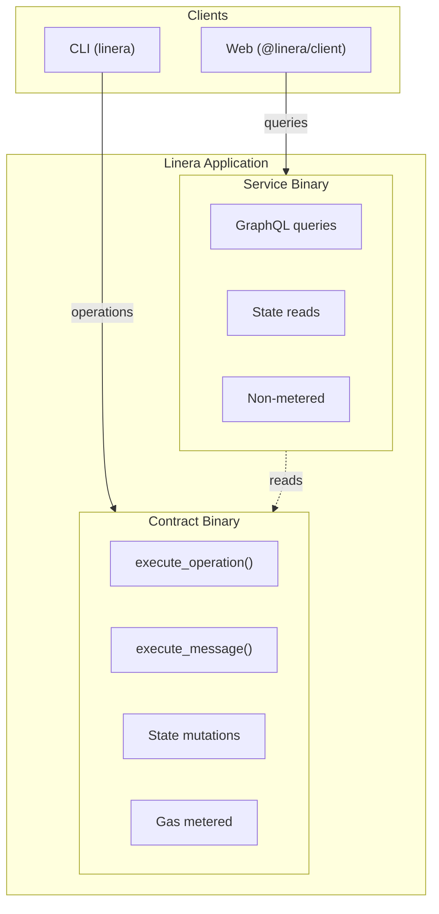
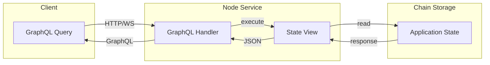
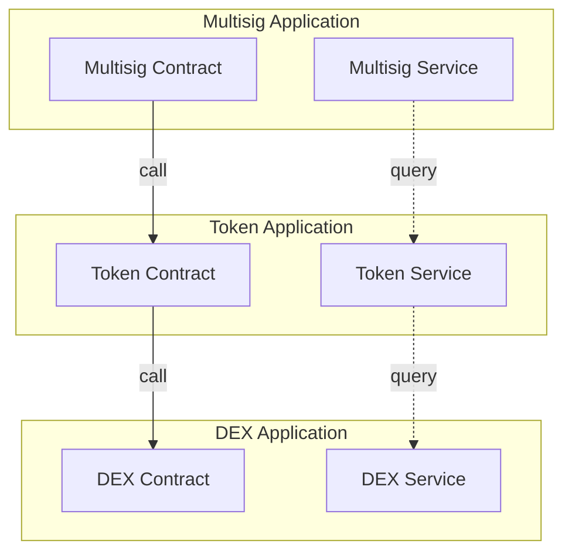

# Application Architecture

Application component structure and deployment model.

## Dual-Binary Model



```

                    DUAL-BINARY APPLICATION MODEL                        

                                                                         
     
                        APPLICATION BINARIES                           
     
         CONTRACT (contract.wasm)       SERVICE (service.wasm)       
     
    • Handles operations           • Handles GraphQL queries         
    • Handles cross-chain msgs     • Read-only access                
    • Modifies state               • Non-metered (no gas)            
    • Gas metered (limited)        • Free for users                  
    • Runs inside validators       • Runs in node service            
                                                                     
    Entry points:                  Entry points:                     
    execute_operation()            query()                           
    execute_message()              subscribe()                       
                                                                     
    State: Read + Write            State: Read only                  
     
                                                                         
     
                           STATE STORAGE                               
           
      Application State (key-value store)                            
      • Persisted across blocks                                      
      • Accessible by both contract and service                      
      • Scoped to application instance                               
           
     
                                                                         

```

## Contract Entry Points

```

                      CONTRACT ENTRY POINTS                              

                                                                         
  1. INITIALIZE (Once, on deployment)                                    
                                                          
     publish-    Deploy bytecode to chain                              
     and-                                                      
     create                                             
               initialize   Called once with init args  
                              (context)                                
                                                          
                                                                        
                                                                        
                                                          
                              Set up                                   
                              initial                                  
                              state                                    
                                                          
                                                                         
  2. EXECUTE OPERATION (User-initiated)                                  
                                                          
     User                                                              
     Signs                                                             
     Operation                                                         
                                                          
                                                                        
                                                                        
                           
    Validate     Execute      Update                    
    Operation         Logic             State                     
                           
                                                                        
                                                    
                                                                        
                                                                        
                                           
                         Emit              Return                    
                         Messages          Result                    
                         (optional)                                  
                                           
                                                                         
  3. EXECUTE MESSAGE (Cross-chain)                                       
                                                          
    Message      From another chain's inbox                            
    Received                                                           
                                                          
                                                                        
                                                                        
                           
    Validate     Process      Update                    
    Message           Message           State                     
                           
                                                                        
           If invalid:                                                  
           Bounce (if tracked) or                                    
               Reject (if invalid signature)                             
                                                                         

```

## Service Architecture



```

                      SERVICE ARCHITECTURE                               

                                                                         
                                                      
     Client                                                            
     (Browser/                                                         
     Frontend)                                                         
                                                      
                                                                        
            GraphQL Query                                               
            {                                                           
              proposal(id: 42) {                                        
                id                                                      
                proposer                                                
                approvals                                               
              }                                                         
            }                                                           
                                                                        
                                                                        
     
                        NODE SERVICE                                   
                 
       GraphQL      Service      Application            
       Handler          query()          State View             
                 
                                                                      
                                                  async/await         
                                                                      
                                                       
                                            Read State              
                                            (no gas!)               
                                                       
                                                                      
     
                                                                        
                                                                        
     
                        CHAIN STORAGE                                  
           
      Application State (RocksDB / Local Storage)                    
      Key: (application_id, chain_id, key)                           
      Value: serialized state                                        
           
     
                                                                        
                                                                        
                                                      
     Response                                                          
     {                                                                 
       "proposal":                                                     
         {                                                             
           "id":                                                       
           42,                                                         
           ...                                                         
         }                                                             
     }                                                                 
                                                      
                                                                         
  KEY POINT: No gas fees for queries!                                    
                                                                         

```

## Application Lifecycle

```

                      APPLICATION LIFECYCLE                              

                                                                         
  Phase 1: DEVELOPMENT                                                   
                                                          
    Write        Rust code using linera-sdk                            
    Contract     • Define state                                        
    Code         • Implement execute_operation                         
    • Implement execute_message                           
                                                                        
                                                                        
                                                          
    Write        • Define GraphQL schema                               
    Service      • Implement query handlers                            
    Code                                                               
                                                          
                                                                        
                                                                        
                                                          
    Build        cargo build --target wasm32-unknown-unknown           
    Wasm         Produces: contract.wasm, service.wasm                 
                                                          
                                                                        
                                                                        
  Phase 2: DEPLOYMENT                                                    
                                                          
    Publish      linera publish-bytecode contract.wasm service.wasm    
    Bytecode     Returns: bytecode_id                                  
                                                          
                                                                        
                                                                        
                                                          
    Create       linera create-application $BYTECODE_ID --json-arg {} 
    Instance     Returns: application_id                               
                                                          
                                                                        
                                                                        
  Phase 3: OPERATION                                                     
                                                          
    Users        • Call operations (contract)                          
    Interact     • Query state (service)                               
                 • Cross-chain messaging                               
                                                          
                                                                        
                                                                        
  Phase 4: MAINTENANCE                                                   
                                                          
    Upgrade      • Publish new bytecode                                
    (Optional)   • Migrate state                                       
                                                          
                                                                         

```

## Application Composition



---

## Related Documentation

- [System Architecture](./system-architecture.md)
- [Multisig Flow](./multisig-flow.md)
- [Message Flow](./message-flow.md)
