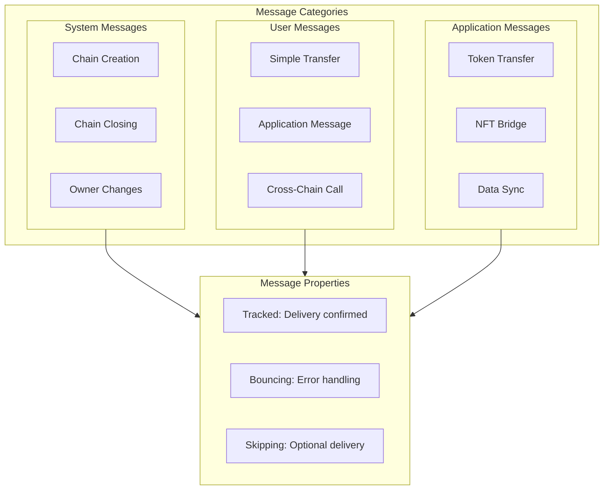
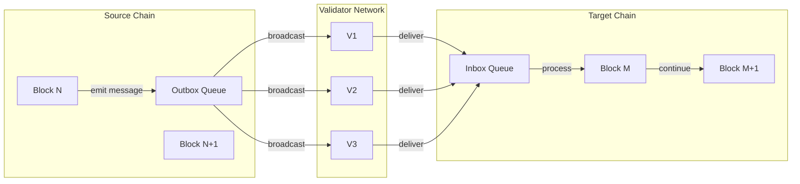

# Message Flow

Cross-chain messaging patterns and data flow.

## Message Types



## Cross-Chain Transfer Flow

```

                      CROSS-CHAIN TRANSFER FLOW                            

                                                                           
  Step 1: Initiate on Source Chain                                         
                                                            
     User                                                                
    Operation                                                            
                                                            
                                                                          
                                                                          
                                                            
     Source      1. Deduct balance from user                             
     Chain       2. Create outgoing message                                
     (Local)     3. Add to outbox                                         
                                                            
                                                                          
           Message: {                                                       
             origin: SourceChain,                                           
             destination: TargetChain,                                      
             authenticated_signer: User,                                    
             amount: 100,                                                   
             kind: Tracked                                                  
           }                                                                
                                                                          
                                                                          
       
                        VALIDATOR NETWORK                                
                           
        V1         V2         V3         V4                    
                           
                              
                                                                       
       
                                                                          
                                                                          
  Step 2: Routing and Delivery                                             
       
    Validators:                                                         
    • Track outgoing messages from each chain                           
    • Queue messages in target chain's inbox                            
    • Provide proofs of delivery                                        
       
                                                                          
                                                                          
  Step 3: Receive on Target Chain                                          
                                                            
     Target      1. Message appears in inbox                            
     Chain       2. Owner includes message in next block                
     Inbox       3. Process message (credit recipient)                  
                                                            
                                                                           
       
    Result:                                                             
    • User balance: -100 on Source                                      
    • Recipient balance: +100 on Target                                 
    • Both changes validated by same validator set                      
       
                                                                           

```

## Inbox/Outbox Model



```

                     INBOX / OUTBOX MODEL                             

                                                                      
   SOURCE CHAIN                    TARGET CHAIN                       
                                               
                                                                      
                                        
      Block                         Block                         
      Being                         Being                         
      Created                       Created                       
                                        
                                                                    
            Execute operation              Select messages          
                           from inbox               
                                                                    
            Side effect:                                            
            Add to OUTBOX                                           
                                                                    
                                        
                                                                  
      OUTBOX                        INBOX                         
                                                                  
    [Msg to A]           [Msg from X]                    
    [Msg to B]            [Msg from Y]                    
    [Msg to C]              [Msg from Z]                    
                                                               
                                     
                                                                  
                          VALIDATORS (shared security)            
                                           
                                             
                                              
                                                                      
   Key properties:                                                    
   • Outbox is ordered (FIFO)                                         
   • Inbox messages must be processed in order                        
   • Owner chooses which messages to include                          
   • Messages can skip if application allows                          
                                                                      

```

## Message Kinds

```

                         MESSAGE KINDS                                   

                                                                         
  TRACKED MESSAGES (Guaranteed delivery)                                 
                                                          
     Send                                                              
     Message                                                           
                                                          
                                                                        
                                                                        
                           
    Message      In Target    Process                   
    in Outbox         Inbox             Success                   
                           
                                                                       
                               If process fails                       
                                                                       
                                                         
                       Bounce                                         
                       Back                                           
                                                         
                                                                       
           Returns to source chain                  
                                                                         
     
                                                                         
  BOUNCING MESSAGES (Error handling)                                     
                                                          
     Send        Same flow as tracked, but:                            
     (Bounce)    • Error response handled specially                    
    • Application can react to failure                    
                                                                        
                                                                        
                           
    Process       Error       Bounce                    
    Attempt            Occurs           Response                  
                           
                                                                        
                                                                        
                                                        
                                           Source                    
                                           Handles                   
                                           Error                     
                                                        
                                                                         
     
                                                                         
  SKIPPING MESSAGES (Optional delivery)                                  
                                                          
     Send        • Target chain can skip without bouncing              
     (Skip)      • Use case: notifications, non-critical updates       
    • Sender doesn't require confirmation                 
                                                                        
                                                                        
                           
    Message      Target       Process OR                
    Sent              Receives          Skip                      
                           
                                                                        
                                                                        
                                                          
                                                       Dropped         
                                                      (No bounce)      
                                                          
                                                                         

```

## Authentication Chain

```

                    AUTHENTICATION PROPAGATION                       

                                                                     
  Cross-chain messages maintain authentication context               
                                                                     
  Chain A  Chain B  Chain C                
                                                                     
                                   
    User               App               App                  
    Signs             on B              on C                  
                                   
                                                                  
        Operation          Message            Message             
                                                                  
   
    authenticated_signer: User (original signer)                  
    authenticated_caller: Chain A → Chain B → Chain C             
                                                                  
    Application can:                                              
    • Verify original signer                                      
    • Verify calling chain path                                   
    • Implement replay protection                                 
   
                                                                     
  Example: User on A calls cross-chain swap                          
  1. User signs operation on Chain A                                 
  2. Chain A sends message to DEX on Chain B                         
  3. DEX on B sends message to Token on Chain C                      
  4. Token on C sees: signer=User, path=A→B→C                       
  5. Token verifies User's balance on A (via state proof)           
                                                                     

```

## Message Latency

| Path | Expected Latency | Notes |
|------|------------------|-------|
| Same chain | 1 block | Immediate execution |
| Cross-chain (same validator set) | 2-3 blocks | One block each + routing |
| Cross-chain (with finality) | 6+ blocks | Additional confirmation depth |

---

## Related Documentation

- [System Architecture](./system-architecture.md)
- [Microchain Lifecycle](./microchain-lifecycle.md)
- [Multisig Flow](./multisig-flow.md)
