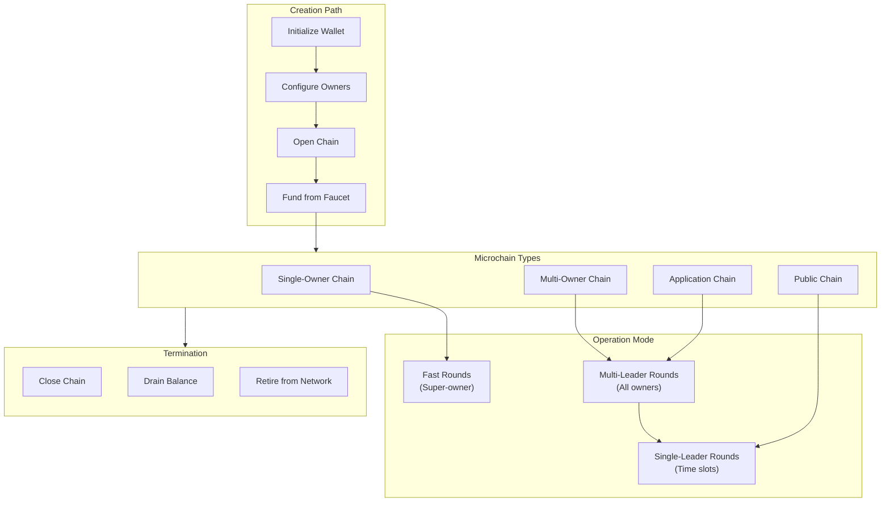
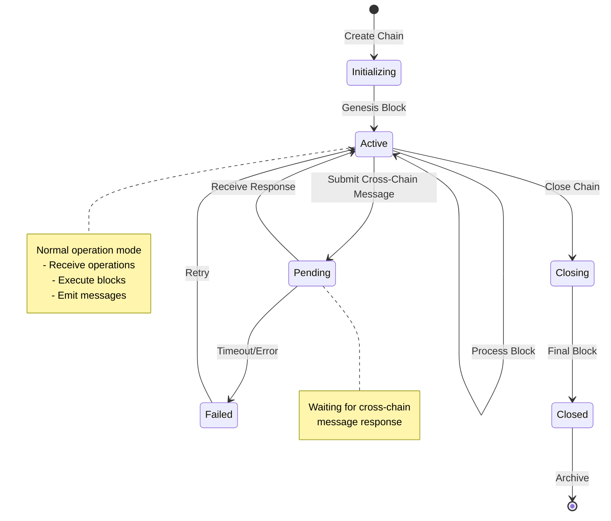

# Microchain Lifecycle

Chain creation, operation, and termination flow.

## Chain Types



## Creation Flow

### Single-Owner Chain

```
User Action                           System Response
───────────                           ───────────────
                                      
┌─────────────┐                       ┌─────────────┐
│  Request    │                       │             │
│  New Chain  │                       │             │
└──────┬──────┘                       │             │
       │                              │             │
       ▼                              │             │
┌─────────────┐                       │             │
│  Generate   │                       │             │
│  Chain ID   │                       │             │
└──────┬──────┘                       │             │
       │                              │             │
       ▼                              │             │
┌─────────────┐                       │             │
│  Create     │                       │             │
│  Genesis    │                       │             │
│  Block      │──────────────────────▶│  Validator  │
└──────┬──────┘                       │  Accepts    │
       │                              │  Chain      │
       ▼                              └─────────────┘
┌─────────────┐                       ┌─────────────┐
│  Add to     │                       │  Chain      │
│  Wallet     │                       │  Active     │
└─────────────┘                       └─────────────┘

Timeline: ~1-2 seconds
```

### Multi-Owner Chain

```
Step 1: Owner Identification                    Step 2: Chain Creation
───────────────────────────                     ─────────────────────

┌─────────┐   ┌─────────┐   ┌─────────┐         ┌─────────────┐
│ Owner A │   │ Owner B │   │ Owner C │         │  Main Chain │
│(Creator)│   │         │   │         │         │  (Parent)   │
└────┬────┘   └────┬────┘   └────┬────┘         └──────┬──────┘
     │             │             │                      │
     │  Collect    │  Public     │  Public              │
     │  Public     │  Keys       │  Keys                │
     │  Keys       │             │                      │
     └─────────────┴─────────────┘                      │
                   │                                    │
                   ▼                                    ▼
          ┌─────────────┐                      ┌─────────────┐
          │  Configure  │─────────────────────▶│  Open-Multi-│
          │  Ownership  │                      │  Owner-Chain│
          │  (N-of-N)   │                      │  Operation  │
          └─────────────┘                      └──────┬──────┘
                                                      │
                                                      ▼
                                             ┌─────────────┐
                                             │  Genesis    │
                                             │  Block with │
                                             │  All Owners │
                                             └─────────────┘

Step 3: Owner Configuration                     Step 4: Chain Active
───────────────────────────                     ───────────────────

┌─────────────┐                                 ┌─────────────┐
│  Each Owner │                                 │  Multi-Owner│
│  Receives   │                                 │  Chain      │
│  Chain ID   │                                 │  Operational│
└──────┬──────┘                                 └──────┬──────┘
       │                                              │
       ▼                                              ▼
┌─────────────┐                                 ┌─────────────┐
│  Add to     │                                 │  Consensus: │
│  Local      │                                 │  Multi-     │
│  Wallet     │                                 │  Leader     │
└─────────────┘                                 │  (1-of-N)   │
                                                └─────────────┘

Note: For m-of-N threshold, deploy custom application contract
```

## Consensus Rounds

```
┌─────────────────────────────────────────────────────────────────────┐
│                        CONSENSUS ROUNDS                             │
├─────────────────────────────────────────────────────────────────────┤
│                                                                     │
│  ROUND TYPE 1: FAST ROUNDS                                          │
│  ┌─────────────┐                                                    │
│  │ Super-Owner │  Only designated super-owner can propose           │
│  │  Proposes   │  Minimal latency, no contention                    │
│  └──────┬──────┘                                                    │
│         │                                                           │
│         ▼                                                           │
│  ┌─────────────┐                                                    │
│  │  Validators │  Quick validation and execution                    │
│  │  Execute    │                                                    │
│  └─────────────┘                                                    │
│                                                                     │
│  ROUND TYPE 2: MULTI-LEADER ROUNDS                                  │
│  ┌─────────┐ ┌─────────┐ ┌─────────┐                               │
│  │ Owner A │ │ Owner B │ │ Owner C │  Any owner can propose         │
│  │ Can     │ │ Can     │ │ Can     │  Handles occasional contention │
│  │ Propose │ │ Propose │ │ Propose │                                │
│  └────┬────┘ └────┬────┘ └────┬────┘                               │
│       │           │           │                                     │
│       └───────────┼───────────┘                                     │
│                   ▼                                                 │
│            ┌─────────────┐                                          │
│            │  Select     │  Round-robin with timeout fallback       │
│            │  Proposer   │                                          │
│            └──────┬──────┘                                          │
│                   │                                                 │
│                   ▼                                                 │
│            ┌─────────────┐                                          │
│            │  Execute    │                                          │
│            └─────────────┘                                          │
│                                                                     │
│  ROUND TYPE 3: SINGLE-LEADER ROUNDS                                 │
│  ┌─────────┬─────────┬─────────┬─────────┐                         │
│  │ Slot 1  │ Slot 2  │ Slot 3  │ Slot 4  │  Time-based rotation   │
│  │(Owner A)│(Owner B)│(Owner C)│(Owner A)│  Predictable schedule  │
│  └────┬────┴────┬────┴────┬────┴────┬────┘                         │
│       │         │         │         │                               │
│       └─────────┴────┬────┴─────────┘                               │
│                      ▼                                              │
│               ┌─────────────┐                                       │
│               │  Scheduled  │                                       │
│               │  Execution  │                                       │
│               └─────────────┘                                       │
│                                                                     │
└─────────────────────────────────────────────────────────────────────┘
```

## Chain State Transitions



## Lifecycle Events

| Event | Description | Trigger |
|-------|-------------|---------|
| **Genesis** | Chain creation | `open-chain` or `open-multi-owner-chain` |
| **Block** | State transition | Owner proposes operation |
| **Message Out** | Cross-chain send | Operation emits message |
| **Message In** | Cross-chain receive | Message processed from inbox |
| **Close** | Chain termination | `close-chain` operation |
| **Reopen** | Chain resurrection | On first new operation after close |

## Owner Management

### Adding/Removing Owners

```
Current State: Multi-Owner Chain with Owners A, B, C

Add Owner D:
┌─────────┐
│ Owner A │  (super-owner)
│ Proposes│
│ Add D   │
└────┬────┘
     │
     ▼
┌─────────────┐
│  Validators │
│  Execute    │
│  Change     │
└──────┬──────┘
       │
       ▼
┌─────────────┐
│ New Owners: │
│ A, B, C, D  │
└─────────────┘

Remove Owner C:
┌─────────┐
│ Owner A │  (super-owner)
│ Proposes│
│ Remove C│
└────┬────┘
     │
     ▼
┌─────────────┐
│ New Owners: │
│ A, B, D     │
└─────────────┘
```

---

## Related Documentation

- [System Architecture](./system-architecture.md)
- [Multisig Flow](./multisig-flow.md)
- [Message Flow](./message-flow.md)
