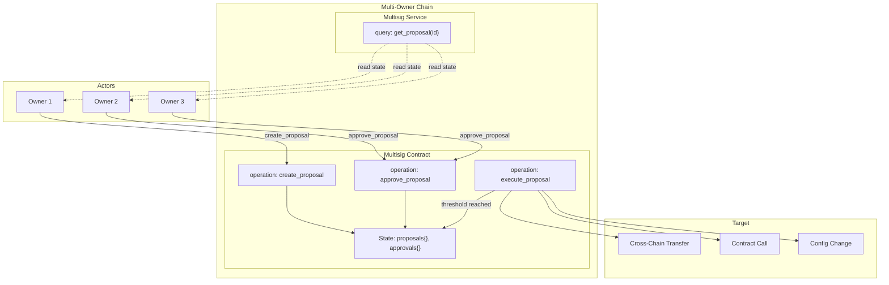
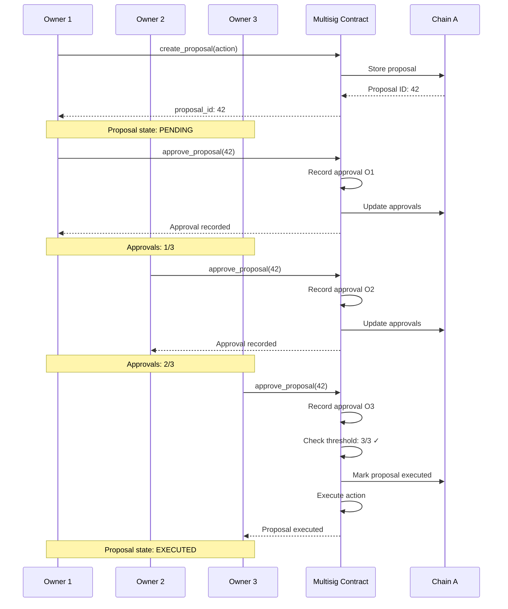

# Multisig Flow

Application-level multisig proposal, approval, and execution flow.

## Architecture Overview



## Proposal Lifecycle

```
┌─────────────────────────────────────────────────────────────────────────┐
│                        PROPOSAL LIFECYCLE                               │
├─────────────────────────────────────────────────────────────────────────┤
│                                                                         │
│  1. CREATE PROPOSAL                                                     │
│  ┌─────────────┐                                                        │
│  │   Owner     │                                                        │
│  │  (any of    │                                                        │
│  │   N owners) │                                                        │
│  └──────┬──────┘                                                        │
│         │                                                               │
│         ▼                                                               │
│  ┌─────────────────────────────────────────────────────────────────┐   │
│  │ Proposal Structure:                                             │   │
│  │ {                                                               │   │
│  │   id: u64,                                                      │   │
│  │   proposer: Owner,                                              │   │
│  │   action: Action,      // transfer, call, config                │   │
│  │   description: String,                                          │   │
│  │   created_at: Timestamp,                                        │   │
│  │   expires_at: Timestamp,                                        │   │
│  │   approvals: Vec<Owner>  // starts with [proposer]              │   │
│  │ }                                                               │   │
│  └─────────────────────────────────────────────────────────────────┘   │
│         │                                                               │
│         ▼                                                               │
│  ┌─────────────┐                                                        │
│  │   PENDING   │  ←─ Current state: waiting for approvals              │
│  │   STATE     │                                                        │
│  └──────┬──────┘                                                        │
│         │                                                               │
│         │  2. APPROVE PROPOSAL (repeated m-1 times)                     │
│         │                                                               │
│         ▼                                                               │
│  ┌─────────────┐                                                        │
│  │   Owners    │                                                        │
│  │  (distinct  │  Each approval is a separate operation               │
│  │   from      │  on the multi-owner chain                             │
│  │   proposer) │                                                        │
│  └──────┬──────┘                                                        │
│         │                                                               │
│         ▼                                                               │
│  ┌─────────────────────────────────────────────────────────────────┐   │
│  │ Update: approvals.push(owner)                                   │   │
│  │ Validation:                                                     │   │
│  │   - Not already approved                                        │   │
│  │   - Is valid owner                                              │   │
│  │   - Proposal not expired                                        │   │
│  │   - Not already executed                                        │   │
│  └─────────────────────────────────────────────────────────────────┘   │
│         │                                                               │
│         ▼                                                               │
│  ┌─────────────────┐                                                    │
│  │ Check threshold │  approvals.len() >= m?                              │
│  └───────┬─────────┘                                                    │
│          │                                                              │
│    ┌─────┴─────┐                                                        │
│    │           │                                                        │
│    ▼           ▼                                                        │
│  ┌──────┐  ┌────────┐                                                   │
│  │ YES  │  │  NO    │  ←─ Continue waiting for more approvals           │
│  └──┬───┘  └────────┘                                                   │
│     │                                                                   │
│     │  3. EXECUTE PROPOSAL                                              │
│     │                                                                   │
│     ▼                                                                   │
│  ┌─────────────────────────────────────────────────────────────────┐   │
│  │ Execute action:                                                 │   │
│  │   - Transfer: emit message to target chain                      │   │
│  │   - Call: execute contract operation                            │   │
│  │   - Config: update local state                                  │   │
│  │ Mark: executed = true                                           │   │
│  └─────────────────────────────────────────────────────────────────┘   │
│     │                                                                   │
│     ▼                                                                   │
│  ┌─────────────┐                                                        │
│  │  EXECUTED   │  ←─ Final state                                        │
│  │   STATE     │                                                        │
│  └─────────────┘                                                        │
│                                                                         │
│  ALTERNATIVE PATHS:                                                     │
│  ┌─────────────────────────────────────────────────────────────────┐   │
│  │ CANCEL: Proposal creator can cancel before execution             │   │
│  │ EXPIRE: After expires_at, anyone can mark as expired             │   │
│  │ REJECT: Not implemented (implicit via non-approval)              │   │
│  └─────────────────────────────────────────────────────────────────┘   │
│                                                                         │
└─────────────────────────────────────────────────────────────────────────┘
```

## Cross-Chain Transfer Example

```
SCENARIO: 3-of-3 multisig transferring 100 tokens to Chain B

Chain A (Multisig Contract)              Network                Chain B
────────────────────────────             ───────                ───────

Step 1: Create Proposal
┌─────────┐
│ Owner A │  Creates proposal:
│(proposer)│   "Transfer 100 to B"
└────┬────┘
     │
     ▼
┌─────────────┐
│ Store in    │  State.proposals[id] = proposal
│ contract    │  State.approvals[id] = [A]
│ state       │
└──────┬──────┘
       │
       │  Proposal created
       │  Awaiting 2 more approvals

Step 2: Owner B Approves
┌─────────┐
│ Owner B │  Calls approve_proposal(id)
└────┬────┘
     │
     ▼
┌─────────────┐
│ Add to      │  State.approvals[id] = [A, B]
│ approvals   │  Count: 2/3 (need 1 more)
└─────────────┘

Step 3: Owner C Approves
┌─────────┐
│ Owner C │  Calls approve_proposal(id)
└────┬────┘
     │
     ▼
┌─────────────┐
│ Add to      │  State.approvals[id] = [A, B, C]
│ approvals   │  Count: 3/3 ✓ THRESHOLD REACHED
└──────┬──────┘
       │
       │  Auto-trigger OR
       │  explicit execute call
       ▼

Step 4: Execute Transfer
┌─────────────┐
│ Emit        │  Message {
│ message     │    destination: Chain B,
└──────┬──────┘    amount: 100,
       │           authenticated_signer: Chain A
       │         }
       │
       │  Cross-chain message
       └───────────────────────▶  Validators route
                                  message
                                    │
                                    ▼
                           ┌─────────────┐
                           │  Chain B    │
                           │  Inbox      │
                           └──────┬──────┘
                                  │
                                  ▼
                           ┌─────────────┐
                           │  Process    │
                           │  Transfer   │
                           │  Credit 100 │
                           └─────────────┘

Total operations: 4 (create + 3 approvals)
Each operation = 1 on-chain transaction
```

## Contract State Structure

```rust
// Simplified state structure
pub struct MultisigContract {
    // Configuration
    pub owners: Vec<Owner>,           // All owners
    pub threshold: u32,                // m-of-n threshold
    
    // Proposals
    pub proposals: Map<ProposalId, Proposal>,
    pub approvals: Map<ProposalId, Vec<Owner>>,
    pub executed: Map<ProposalId, bool>,
    
    // Counter
    pub next_proposal_id: u64,
}

pub struct Proposal {
    pub id: ProposalId,
    pub proposer: Owner,
    pub action: Action,
    pub description: String,
    pub created_at: Timestamp,
    pub expires_at: Timestamp,
}

pub enum Action {
    Transfer {
        destination: ChainId,
        amount: Amount,
        recipient: Account,
    },
    ContractCall {
        application: ApplicationId,
        operation: Vec<u8>,
    },
    ConfigChange {
        new_owners: Option<Vec<Owner>>,
        new_threshold: Option<u32>,
    },
}
```

## Sequence Diagram



## Error Handling

| Error | Cause | Resolution |
|-------|-------|------------|
| `DuplicateApproval` | Owner tries to approve twice | No action needed |
| `InvalidOwner` | Non-owner tries to approve | Must be owner |
| `ProposalExpired` | Approval after expiration | Create new proposal |
| `AlreadyExecuted` | Action on executed proposal | None - already done |
| `ThresholdNotMet` | Execute before enough approvals | Wait for more approvals |
| `InsufficientBalance` | Transfer exceeds balance | Fund chain or reduce amount |

---

## Comparison: Protocol vs Application Multisig

```
┌─────────────────────────────────────────────────────────────────────┐
│                    PROTOCOL-LEVEL MULTISIG                          │
│                         (Built-in)                                  │
├─────────────────────────────────────────────────────────────────────┤
│  • Multi-owner chains: N owners, any 1 can sign                     │
│  • Consensus handles contention between owners                      │
│  • No threshold logic - always 1-of-N                               │
│  • Fast/multi-leader/single-leader rounds                           │
│  • Use case: Shared access to chain                                 │
└─────────────────────────────────────────────────────────────────────┘
                              │
                              ▼ Build on top
┌─────────────────────────────────────────────────────────────────────┐
│                   APPLICATION-LEVEL MULTISIG                        │
│                    (Custom Contract)                                │
├─────────────────────────────────────────────────────────────────────┤
│  • Deployed as application on multi-owner chain                     │
│  • Custom threshold logic: m-of-N approvals required                │
│  • Each approval = separate operation (transaction)                 │
│  • Contract tracks approvals in state                               │
│  • Use case: Treasury, governance, time-locked transfers            │
└─────────────────────────────────────────────────────────────────────┘
```

---

## Related Documentation

- [Microchain Lifecycle](./microchain-lifecycle.md)
- [Application Architecture](./application-architecture.md)
- [Message Flow](./message-flow.md)
