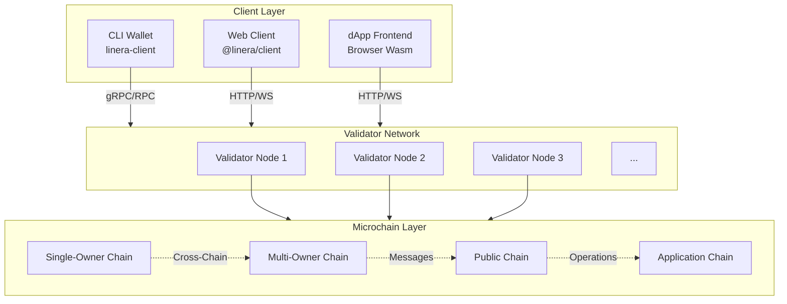

# System Architecture

High-level overview of the Linera blockchain architecture.

## Overview



## Component Layers

```

                         APPLICATION LAYER                               
           
     Wallets         dApps          DEX          Identity      
    (CLI/Web)      (Browser)      Contracts      Services      
           

                                                          
                                                          

                          SERVICE LAYER                                  
    
    Application Services (Non-metered, read-only, GraphQL queries)    
    

          
          

                         CONTRACT LAYER                                  
    
    Application Contracts (Gas-metered, state changes, operations)    
    

          
          

                          PROTOCOL LAYER                                 
           
     Chain          Message        Block          Cross-       
    Creation        Passing       Formation       Chain        
                                                  Sync         
           

          
          

                        VALIDATOR LAYER                                  
           
     Worker         Worker         Worker         Worker       
     (Shard)        (Shard)        (Shard)        (Shard)      
           
                   
                                                                      
                                                            
                          Consensus                                   
                                                            

                               
                               

                         STORAGE LAYER                                   
           
     RocksDB        State          Chain          Block        
     (Local)        Cache          Storage        Archive      
           

```

## Data Flow

### User Transaction Flow

```
User 
           
           
          
   Client App      Prepare Tx        Sign with     
  (Browser/CLI)         (Operations)           Owner Key     
          
                                                        
                                                        
                                               
                                                 Signed Block   
                                                 Proposal       
                                               
                                                        
                                                        
          
  Await Response  Validator Node    Submit to      
  (Confirmation)        (Validation +         Validator      
                         Execution)           Network        
          
         
         

  Transaction    
  Confirmed!     

```

### Cross-Chain Message Flow

```

                           Cross-Chain Messaging                       

                                                                       
   Chain A                                        Chain B              
                                        
     Create                                                       
     Operation                                                    
                                                     
                                                                    
                                                                    
                                      
      Execute      Emit                                    
      Locally           Message                                 
                                      
                                                                    
                                (1) Send                            
                                                                    
                         
           VALIDATOR NETWORK                                      
                                     
        V1     V2     V3     V4                          
                                     
                         
                                                               
                                       
                                                                    
                                (2) Deliver                         
                                                                    
                                                     
                            Chain B                               
                            Inbox                                 
                                                     
                                                                    
                                    (3) Pick                        
                                                                    
                                                      
                                 Next                              
                                 Block                             
                                                      
                                                                    
                                                                    
                                                      
                                 Process                           
                                 Message                           
                                                      
                                                        

```

## Key Design Decisions

| Decision | Rationale |
|----------|-----------|
| **Multi-chain over single-chain** | Parallelism, horizontal scaling, per-user chains |
| **Shared security model** | All chains validated by same validator set |
| **Async cross-chain messaging** | Decouples chain execution, enables scalability |
| **Wasm contracts** | Language flexibility, sandboxed execution |
| **Dual contract/service model** | Separates state changes (metered) from queries (free) |

---

## Related Documentation

- [Microchain Lifecycle](./microchain-lifecycle.md)
- [Message Flow](./message-flow.md)
- [Validator Architecture](./validator-architecture.md)
- [Application Architecture](./application-architecture.md)
