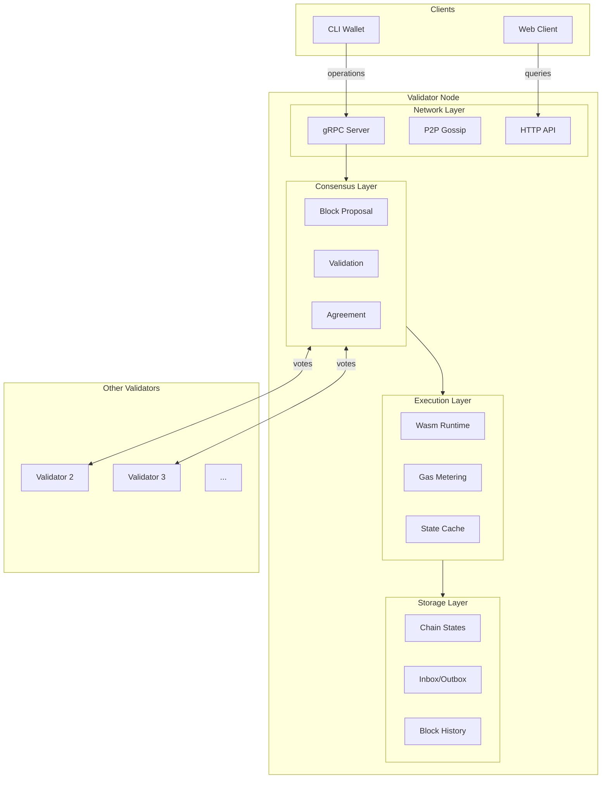

# Validator Architecture

Validator node structure and consensus mechanism.

## Validator Overview



## Node Structure

```
┌─────────────────────────────────────────────────────────────────────────┐
│                      VALIDATOR NODE ARCHITECTURE                        │
├─────────────────────────────────────────────────────────────────────────┤
│                                                                         │
│  ┌─────────────────────────────────────────────────────────────────┐   │
│  │                     API LAYER (Incoming)                         │   │
│  │  ┌─────────────┐  ┌─────────────┐  ┌─────────────┐             │   │
│  │  │   gRPC      │  │   HTTP      │  │    P2P      │             │   │
│  │  │   (Client   │  │   (Node     │  │   (Other    │             │   │
│  │  │    ops)     │  │   Service)  │  │   Validators)│             │   │
│  │  └──────┬──────┘  └──────┬──────┘  └──────┬──────┘             │   │
│  │         └────────────────┴────────────────┘                     │   │
│  └────────────────────────────┬────────────────────────────────────┘   │
│                               │                                         │
│                               ▼                                         │
│  ┌─────────────────────────────────────────────────────────────────┐   │
│  │                    CONSENSUS LAYER                               │   │
│  │  ┌─────────────┐  ┌─────────────┐  ┌─────────────┐             │   │
│  │  │   Block     │  │   Leader    │  │   Vote      │             │   │
│  │  │   Formation │  │   Election  │  │   Collection│             │   │
│  │  └─────────────┘  └─────────────┘  └─────────────┘             │   │
│  │                                                                  │   │
│  │  ┌─────────────────────────────────────────────────────────┐   │   │
│  │  │  Consensus: Simplified (no complex PoW/PoS)             │   │   │
│  │  │  • Chain owners propose blocks                          │   │   │
│  │  │  • Validators validate and vote                         │   │   │
│  │  │  • Fast finality for single-owner chains                │   │   │
│  │  └─────────────────────────────────────────────────────────┘   │   │
│  └────────────────────────────┬────────────────────────────────────┘   │
│                               │                                         │
│                               ▼                                         │
│  ┌─────────────────────────────────────────────────────────────────┐   │
│  │                   EXECUTION LAYER                                │   │
│  │  ┌─────────────┐  ┌─────────────┐  ┌─────────────┐             │   │
│  │  │   Wasm      │  │   Gas       │  │   State     │             │   │
│  │  │   Runtime   │  │   Metering  │  │   Updates   │             │   │
│  │  │             │  │             │  │             │             │   │
│  │  │  Sandboxed  │  │  Track      │  │  Apply      │             │   │
│  │  │  Execution  │  │  Resource   │  │  Changes    │             │   │
│  │  │             │  │  Usage      │  │             │             │   │
│  │  └─────────────┘  └─────────────┘  └─────────────┘             │   │
│  └────────────────────────────┬────────────────────────────────────┘   │
│                               │                                         │
│                               ▼                                         │
│  ┌─────────────────────────────────────────────────────────────────┐   │
│  │                    STORAGE LAYER                                 │   │
│  │  ┌─────────────┐  ┌─────────────┐  ┌─────────────┐             │   │
│  │  │   Chain     │  │   Inbox/    │  │   Block     │             │   │
│  │  │   States    │  │   Outbox    │  │   Store     │             │   │
│  │  │   (RocksDB) │  │   Queues    │  │   (History) │             │   │
│  │  └─────────────┘  └─────────────┘  └─────────────┘             │   │
│  │                                                                  │   │
│  │  ┌─────────────────────────────────────────────────────────┐   │   │
│  │  │  Sharding: Each validator worker handles subset of      │   │   │
│  │  │  chains. Multiple workers per validator for scalability │   │   │
│  │  └─────────────────────────────────────────────────────────┘   │   │
│  └─────────────────────────────────────────────────────────────────┘   │
│                                                                         │
└─────────────────────────────────────────────────────────────────────────┘
```

## Consensus Mechanism

```
┌─────────────────────────────────────────────────────────────────────────┐
│                      LINERA CONSENSUS                                   │
├─────────────────────────────────────────────────────────────────────────┤
│                                                                         │
│  Unlike traditional BFT/PoS consensus, Linera uses a simplified model:  │
│                                                                         │
│  ┌─────────────────────────────────────────────────────────────────┐   │
│  │  1. BLOCK PROPOSAL                                               │   │
│  │                                                                  │   │
│  │     Owner/Leader creates block proposal:                         │   │
│  │     • List of operations to execute                              │   │
│  │     • Messages to process from inbox                             │   │
│  │     • Previous block hash (chain integrity)                      │   │
│  │                                                                  │   │
│  └─────────────────────────────────────────────────────────────────┘   │
│                                                                         │
│  ┌─────────────────────────────────────────────────────────────────┐   │
│  │  2. VALIDATION                                                   │   │
│  │                                                                  │   │
│  │     Validators check:                                            │   │
│  │     ✓ Signatures are valid                                       │   │
│  │     ✓ Operations don't exceed gas limit                          │   │
│  │     ✓ State transitions are valid                                │   │
│  │     ✓ Messages processed in order                                │   │
│  │                                                                  │   │
│  └─────────────────────────────────────────────────────────────────┘   │
│                                                                         │
│  ┌─────────────────────────────────────────────────────────────────┐   │
│  │  3. AGREEMENT                                                    │   │
│  │                                                                  │   │
│  │     For single-owner chains:                                     │   │
│  │     • Owner proposes → Validators validate → Execute             │   │
│  │     • No voting needed (owner is authority)                      │   │
│  │                                                                  │   │
│  │     For multi-owner chains:                                      │   │
│  │     • Multiple owners can propose                                │   │
│  │     • Validators track which block gets quorum                   │   │
│  │     • Fallback to single-leader if contention                    │   │
│  │                                                                  │   │
│  └─────────────────────────────────────────────────────────────────┘   │
│                                                                         │
│  ┌─────────────────────────────────────────────────────────────────┐   │
│  │  4. EXECUTION                                                    │   │
│  │                                                                  │   │
│  │     Once validated:                                              │   │
│  │     • Execute operations in Wasm runtime                         │   │
│  │     • Update chain state                                         │   │
│  │     • Emit outgoing messages                                     │   │
│  │     • Store block in history                                     │   │
│  │                                                                  │   │
│  └─────────────────────────────────────────────────────────────────┘   │
│                                                                         │
│  KEY PROPERTIES:                                                        │
│  • Safety: Validators guarantee no double-spending, no invalid state   │
│  • Liveness: Chain owners guarantee progress (can always propose)      │
│  • No PoW/PoS: Consensus among validators, not for block production    │
│                                                                         │
└─────────────────────────────────────────────────────────────────────────┘
```

## Worker Sharding

```mermaid
flowchart TB
    subgraph Validator["Validator Node"]
        Proxy["Proxy / Load Balancer"]
        
        subgraph Workers["Worker Pool"]
            W1["Worker 1<br/>Chains 1-1000"]
            W2["Worker 2<br/>Chains 1001-2000"]
            W3["Worker 3<br/>Chains 2001-3000"]
            WN["..."]
        end
        
        Proxy --> W1
        Proxy --> W2
        Proxy --> W3
        Proxy --> WN
    end
    
    subgraph Network[""]
        C1["Client A"]
        C2["Client B"]
        V2["Validator 2"]
    end
    
    C1 -->|Chain 500| Proxy
    C2 -->|Chain 1500| Proxy
    V2 <-->|sync| Workers
```

```
┌─────────────────────────────────────────────────────────────────────────┐
│                      WORKER SHARDING                                    │
├─────────────────────────────────────────────────────────────────────────┤
│                                                                         │
│  Problem: Single validator handling millions of chains                  │
│  Solution: Shard chains across multiple workers                         │
│                                                                         │
│  ┌─────────────────────────────────────────────────────────────────┐   │
│  │                      VALIDATOR NODE                              │   │
│  │                                                                  │   │
│  │   ┌─────────────┐                                               │   │
│  │   │   Proxy /   │  Routes requests to correct worker            │   │
│  │   │   Router    │  based on chain_id                            │   │
│  │   └──────┬──────┘                                               │   │
│  │          │                                                       │   │
│  │    ┌─────┴─────┬─────────┬─────────┬─────────┐                  │   │
│  │    │           │         │         │         │                  │   │
│  │    ▼           ▼         ▼         ▼         ▼                  │   │
│  │ ┌──────┐  ┌──────┐  ┌──────┐  ┌──────┐  ┌──────┐              │   │
│  │ │Work- │  │Work- │  │Work- │  │Work- │  │Work- │              │   │
│  │ │er 1  │  │er 2  │  │er 3  │  │er 4  │  │er N  │              │   │
│  │ │      │  │      │  │      │  │      │  │      │              │   │
│  │ │Chains│  │Chains│  │Chains│  │Chains│  │Chains│              │   │
│  │ │0-999│  │1k-2k │  │2k-3k │  │3k-4k │  │...   │              │   │
│  │ └──────┘  └──────┘  └──────┘  └──────┘  └──────┘              │   │
│  │                                                                  │   │
│  │  Each worker:                                                    │   │
│  │  • Owns subset of chain states                                   │   │
│  │  • Processes blocks for those chains                             │   │
│  │  • Communicates with other validators' workers                   │   │
│  │                                                                  │   │
│  └─────────────────────────────────────────────────────────────────┘   │
│                                                                         │
│  BENEFITS:                                                              │
│  • Horizontal scalability within validator                             │
│  • Parallel block processing                                           │
│  • Isolated failures (one worker down ≠ validator down)               │
│                                                                         │
└─────────────────────────────────────────────────────────────────────────┘
```

## Validator Economics

| Role | Responsibility | Reward Source |
|------|---------------|---------------|
| **Validation** | Process blocks, maintain state | Transaction fees |
| **Storage** | Store chain history | Storage fees |
| **Cross-chain routing** | Deliver messages between chains | Message fees |

---

## Related Documentation

- [System Architecture](./system-architecture.md)
- [Microchain Lifecycle](./microchain-lifecycle.md)
- [Message Flow](./message-flow.md)
