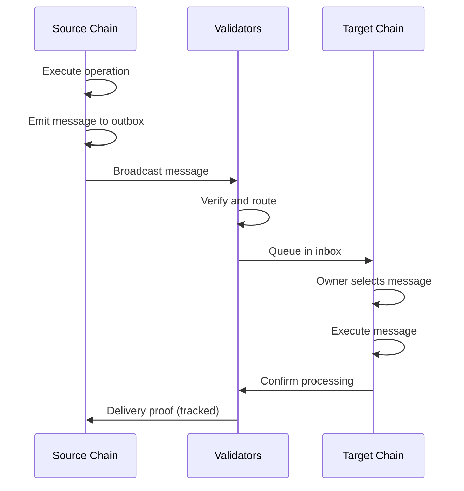

# Cross-Chain Messaging

Asynchronous communication between microchains.

## Overview

Unlike single-chain blockchains where all state is shared, Linera chains are isolated except for explicit message passing. This enables scalability while allowing application composition.

```

                   CROSS-CHAIN MESSAGING                             

                                                                      
   Chain A                          Chain B                          
                                                       
                                                                      
                                       
     Operation                       Message                     
     (Local)                         (Remote)                    
                                       
                                                                   
            State change                    State change           
            on Chain A                      on Chain B             
                                                                   
                                                                   
                                       
     Synchronous                    Asynchronous                  
     Execution                      Execution                    
                                    (via inbox)                  
     Immediate                                                   
     result                         Delayed                      
                                    result                       
                                       
                                                                      
   Key difference: Messages don't execute immediately.                
   They wait in the target chain's inbox for processing.              
                                                                      

```

## Message Flow



## Inbox/Outbox Model

```

                    INBOX / OUTBOX MODEL                             

                                                                      
   SOURCE CHAIN                                                       
                                                          
     
                        OUTBOX                                     
                     
      Msg to B  Msg to C  Msg to D  Msg to B             
      (ID: 1)   (ID: 2)   (ID: 3)   (ID: 4)              
                     
                            
                                                                
     
                                                                    
                        Broadcast to validators                     
                                              
              Validator Network                                    
                                              
                                                                    
                        Route to target                             
   TARGET CHAIN                                                       
                                                          
     
                        INBOX                                      
                     
     From A:1  From A:2  From C:1  From A:4              
     [pending] [pending] [pending] [pending]             
                     
                            
                                                                
     
                                                                    
                        Owner selects for next block                
                                                  
                Process &                                          
                Remove from                                        
                inbox                                              
                                                  
                                                                      
   Key Properties:                                                    
   • Outbox: Ordered, FIFO                                            
   • Inbox: Messages must be processed in order per origin            
   • Owner decides which messages to include                          
   • Validators guarantee delivery (tracked messages)                 
                                                                      

```

## Message Types

### System Messages

Automatically generated by the protocol:

| Message | Purpose | Destination |
|---------|---------|-------------|
| `OpenChain` | Create new chain | New chain genesis |
| `CloseChain` | Terminate chain | Parent chain |
| `ChangeOwnership` | Update owners | Same chain |

### Application Messages

Custom messages defined by applications:

```rust
pub enum Message {
    // Simple transfer
    Transfer {
        amount: Amount,
        recipient: Account,
    },
    
    // Application call
    Call {
        application: ApplicationId,
        operation: Vec<u8>,
    },
    
    // Data sync
    Sync {
        data: Vec<u8>,
        timestamp: Timestamp,
    },
}
```

## Message Kinds

### Tracked Messages

Guaranteed delivery with confirmation:

```
Source Chain                    Target Chain
                    
                                    
      Send tracked message          
     
                                    
                           
                            Processed?     
                           
                                    
                  
                                                   
                                                   
                      
           Success                    Failure       
           Delivery proof             Bounce back   
                      
                                              
                        
    
      Application can react to bounce
```

### Bouncing Messages

Special handling for errors:

```rust
fn execute_message(context: &MessageContext, message: Message) {
    match process_message(message) {
        Ok(result) => {
            // Success - message processed
        }
        Err(error) => {
            if context.message.is_bouncing {
                // This is already a bounce, handle final error
                log!("Final error: {:?}", error);
            } else {
                // Emit bounce message back to sender
                emit_bounce(error);
            }
        }
    }
}
```

### Skipping Messages

Optional messages that can be dropped:

```rust
// Notification that can be skipped
emit(Message::PriceAlert {
    asset: "BTC",
    price: 50000,
    kind: MessageKind::Skipping,
});
// Target can skip without bouncing
```

## Authentication

Messages carry authentication context:

```rust
pub struct MessageContext {
    /// Original signer of the operation that created this message chain
    pub authenticated_signer: Option<Owner>,
    
    /// Chain ID that sent this message
    pub authenticated_caller: Option<ApplicationId>,
    
    /// Message kind (tracked/bouncing/skipping)
    pub message_kind: MessageKind,
    
    /// Height at which message was emitted
    pub height: BlockHeight,
}
```

## Ordering Guarantees

```

                    ORDERING GUARANTEES                              

                                                                      
   Per-Origin Ordering:                                               
                                                           
    Chain A  Msg1Msg2Msg3 Chain B                          
           Must process in order: 1, 2, 3                  
                                                                      
   Cannot process Msg2 before Msg1                                    
   Can skip Msg1 (if skipping kind) and process Msg2                  
                                                                      
     
                                                                      
   Cross-Origin Independence:                                         
    MsgA1MsgA2                                     
    Chain A                                                         
                                                           
    MsgB1MsgB2 Chain C                              
    Chain B                                                         
           Order: A1, B1, A2, B2 (interleaved OK)         
                                                                      
   No ordering requirement between different source chains            
                                                                      

```

## Latency

| Scenario | Expected Blocks | Notes |
|----------|-----------------|-------|
| Same chain | 1 | Immediate |
| Cross-chain (simple) | 2-3 | Source + routing + target |
| Cross-chain (with finality) | 6+ | Additional confirmation |

---

## Related Documentation

- [Applications](./applications.md)
- [Message Flow Diagram](../diagrams/message-flow.md)
- [Multisig Flow](../diagrams/multisig-flow.md)
